## Nitrogenous bases

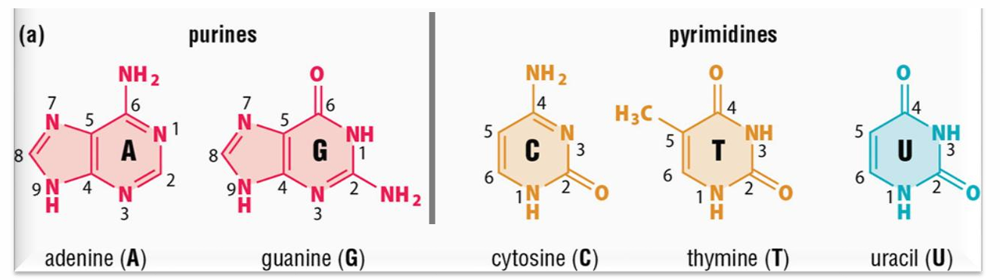

## Nucleotide structure

Sugar + base = Nucleoside (prefix deoxy- or none; e.g. Deoxy-adenosine, or Adenosine) 
Sugar + base + phosphate= Nucleotide

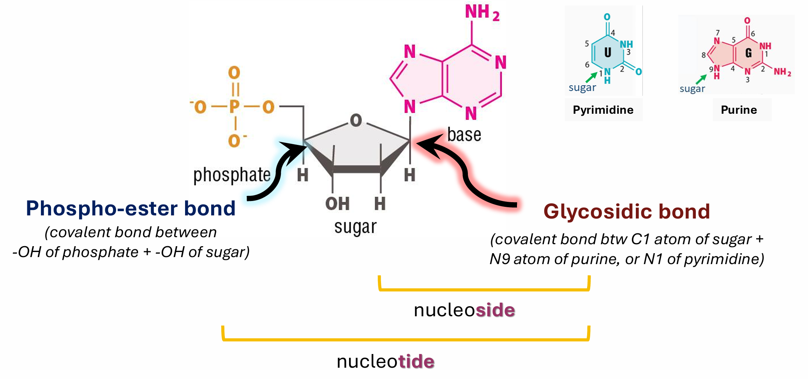

## Polynucleosides

Nucleotides added with a 3′ to 5′ linkage; 3′-OH of nucleotide A attacks the 5’-α-P of nucleotide B.

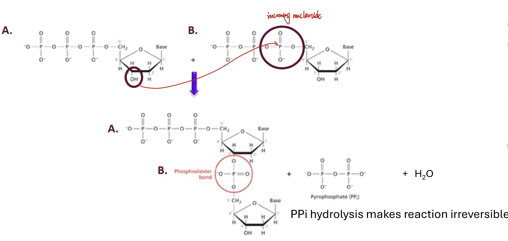

-----

## DNA double helix 3 D conformation

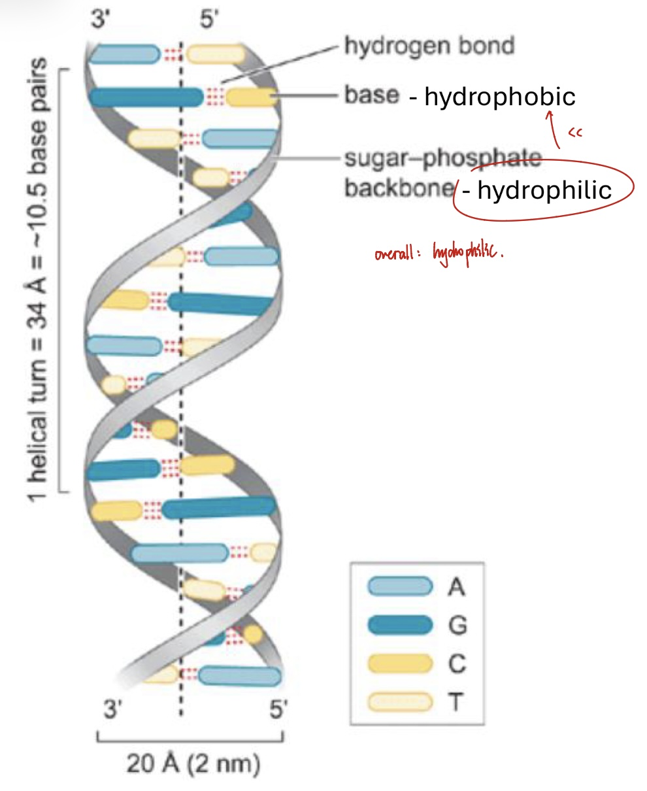

- Two strands associate via hydrogen and Van Der Waals bonds
- Watson-Crick base pairs: A pairs with T with 2 H-bonds, C pairs with G with 3 H-bonds 

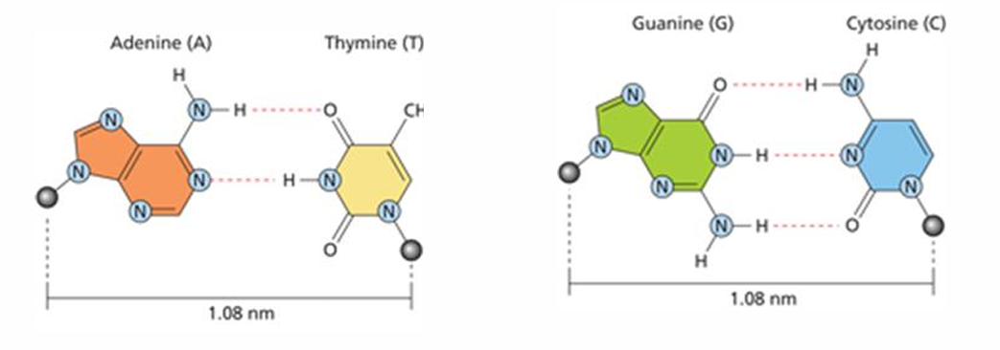

- Chargaff’s rule; purines : pyrimidines = 1 : 1

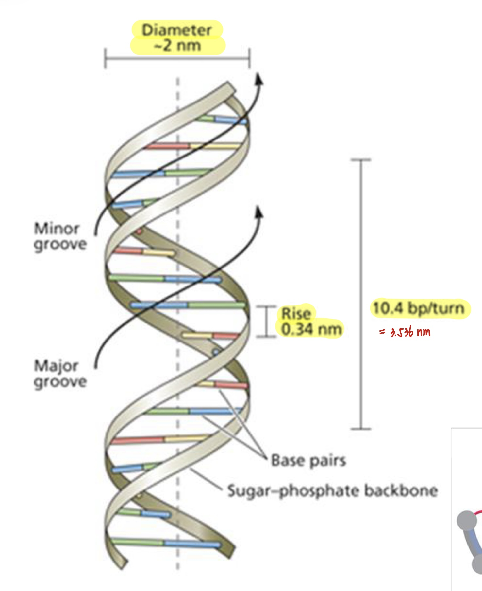

- 2x strands make a full 360° turn every ~10.4bp 
- diameter of DNA helix: ~2nm
- rise between 2 base pairs: 0.34nm
- -ve supercoiled (when condensed) 
- -ve charged 
- Two grooves: “major ” and “minor ”

------

## Alternate DNA conformations

|              | B-DNA (Watson Crick model) | A-DNA                                          | Z-DNA                                                     |
| ------------ | -------------------------- | ---------------------------------------------- | --------------------------------------------------------- |
| Present when | high humidity              | DNA dehydration                                | methylation, torsional stress and high salt concentration |
| Frequency    | most common (>90%)         | less common                                    | least observed                                            |
| Chirality    | right-handed               | right-handed                                   | left-handed       |
| Central core | solid                      | hollow | solid                                                     |
| Major groove | wide and deep              | narrow and deep                                | flat                                                      |
| Minor groove | narrow and shallow         | wide and shallow                               | narrow and deep                                           |
| bp per turn  | 10.4                       | 11                                             | 12                                                        |
| Diameter     | 2nm                        | 2.6nm                                          | 18nm                                                      |

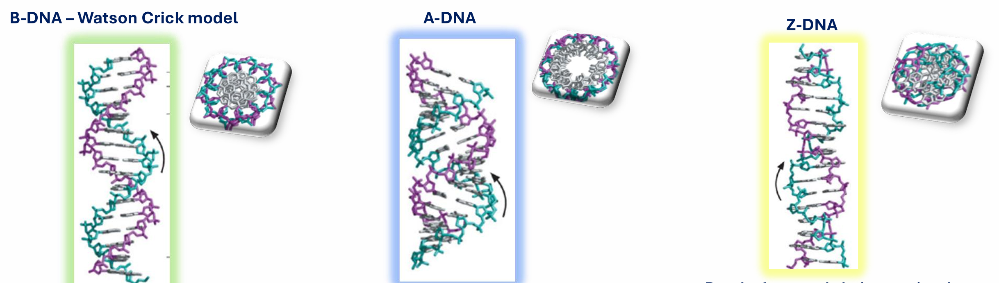

-----

## Paorkaryotic genome packaging

No nucleus. Package DNA by -ve supercoiling. Store DNA in euchromatin-like structures.
- **Archaea** - histone-like proteins 
- **Bacteria** - nucleoid-associated proteins (NAPs)

-----

## Eukaryotic genome packaging

### Euchromatin and heterochromatin

- Eukaryotic chromatin: DNA (~1/3) + proteins (~2/3, mainly histones)
- Two main forms: 
  Euchromatin= Light stained, relaxed, transcriptionally active. Found towards the interrior of the nucleus.
  Heterochromatin = Dark stained, compact, transcriptionally inactive. Found around the peripheryof the nucleoplasm.

|                                              | Euchromatin | Heterochromatin |
| -------------------------------------------- | ----------- | --------------- |
| Percentage during interphase (especially G1) | 90%         | 10%             |
| Percentage during mitosis                    | 0~30%       | 70~100%         |

Telomere(non-coding) and centromere in chromosome: stored as heterochromatin in interphase.

### Histones and nucleosome

#### **4 core histones: H3, H4, H2A, H2B**

- 4 highly conserved core histones
- +ve charged, lysine + arginine, counteract –ve charged DNA and stabillise it.

#### Histone tails

N-terminus tails: H2A, H2B, H3, H4 
C-terminus tails: H2A and H2B 
- 19-39 residues 
- Extend from nucleosome complex 
- Flexible and unstructured 
- Key role for chromatin remodelling 
- Key role for epigenetic regulation

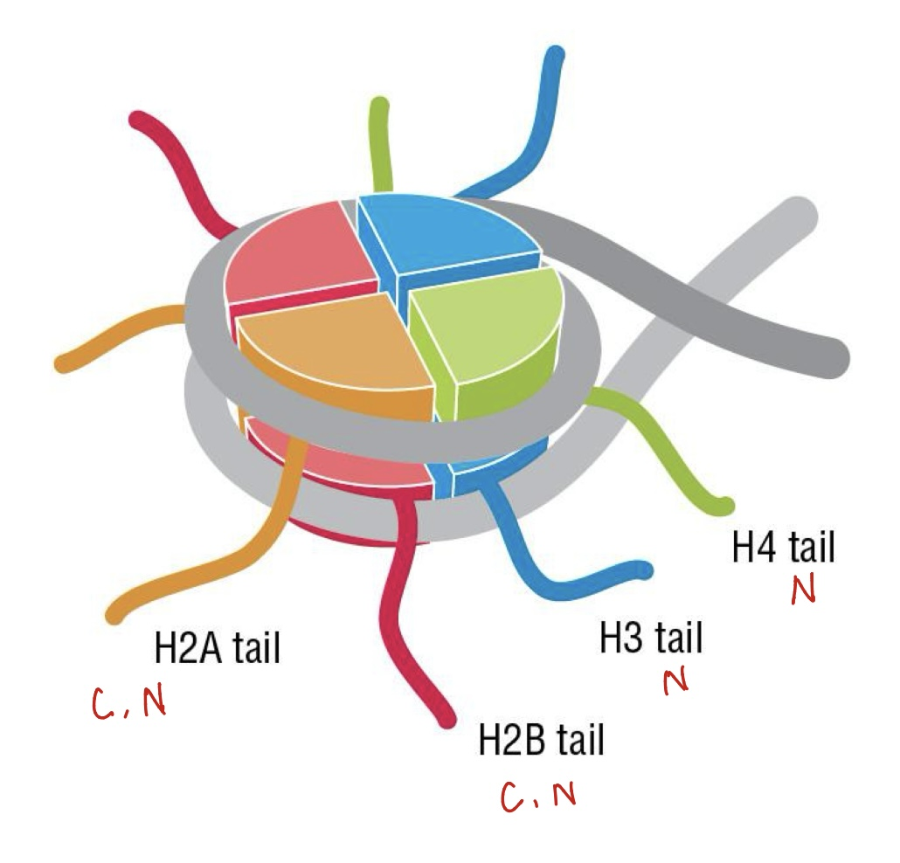

#### Process of nucleosome formation

1. H3 interact with H4, forming H3 – H4 dimer 
2. 2x H3-H4 dimers come together， forming  (H3–H4)₂ tetramer 
3. DNA wraps around it partially (~60bp) 
4. H2A interacts with H2B, forming 2x H2A – H2B dimers 
5. The 2x H2A–H2B dimers then bind on opposite sides of (H3–H4)₂ tetramer 
6. Rest of DNA wraps

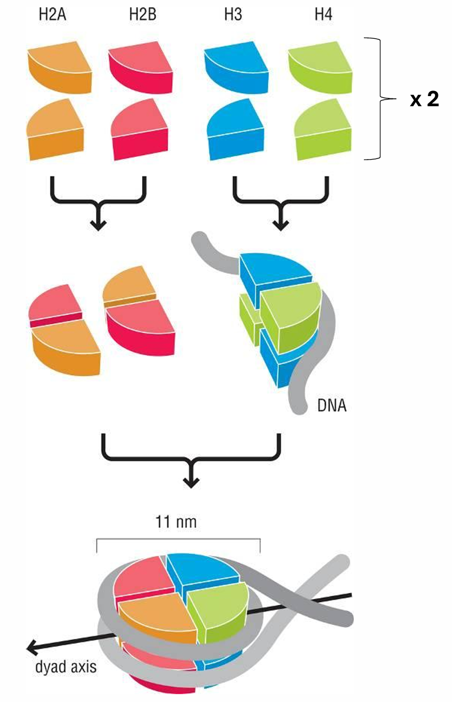

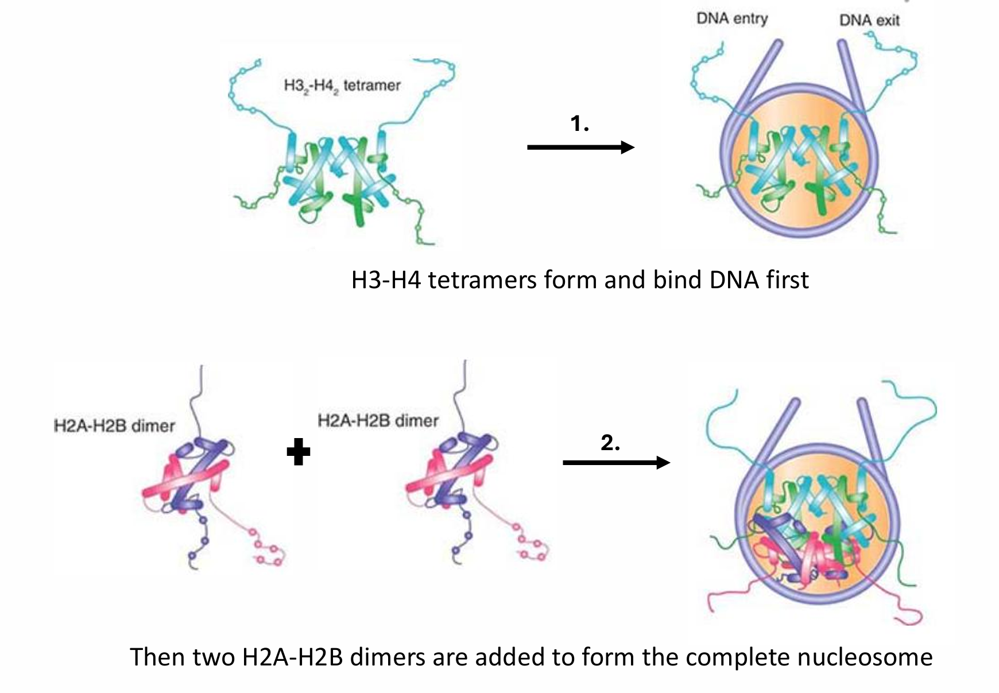

#### Levels of DNA pakaging

Chromatin packing has several layers, leading to more condensed forms:
1. First level = 10nm fiber: nucleosome association with linker DNA, “beads on a string” 
2. Next level = 30nm fiber: H1 “linker” histone is bound to linker DNA - nucleosomes closer to each other.
H1 is removed during DNA transcription.

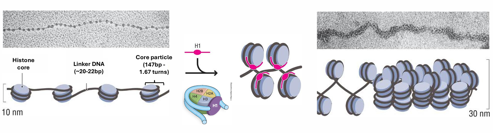

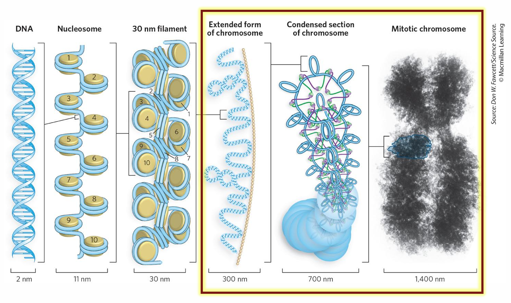

diameter of chromosome: 1400nm
