## Signal sequences

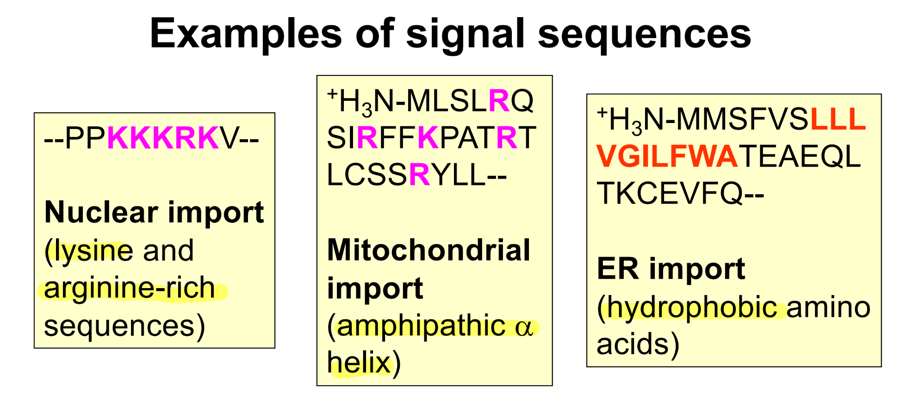

----

## Comparison

|                     | Nuclear             | Mitochondria          | ER                                      |
| ------------------- | ------------------- | --------------------- | --------------------------------------- |
| Translational state | Post-translational  | Post-translational    | Predominantly co-translational (SRP)    |
| Protein imported    | Folded              | Unfolded              | Unfolded                                |
| Receptors           | Importin & exportin | TOM complex           | SRP and SRP receptors                   |
| Channel             | Nuclear pore        | TOM and TIM complexes | Sec61 complex                           |
| Energy dependence   | GTP                 | ATP                   | SRP pathway: GTP Other payhways: ATP |

-----

## Nuclear protein transport

- Receptors: importin (soluble cytosolic proteins, karyopherin family) 
- Channel: nuclear pore 
- The Ran-GTPase drives directional transport through nuclear pores
- Nucleoporins have FG repeats (phenylalanine-glycine repeats) that serve as binding site for importins and exportins

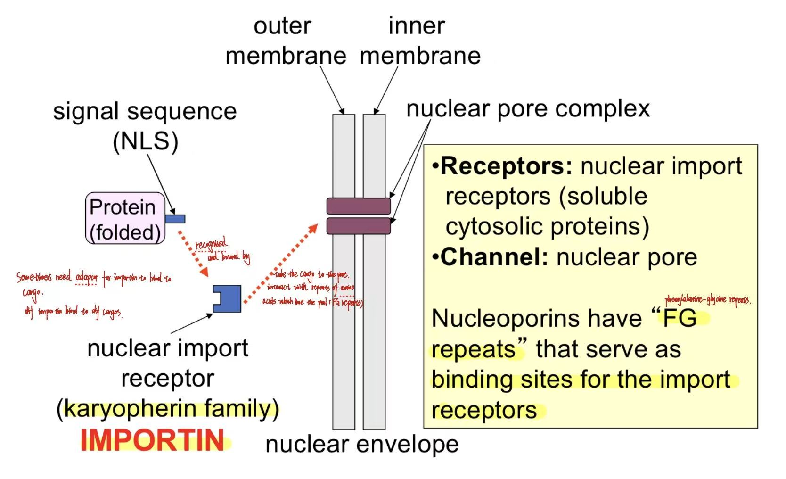

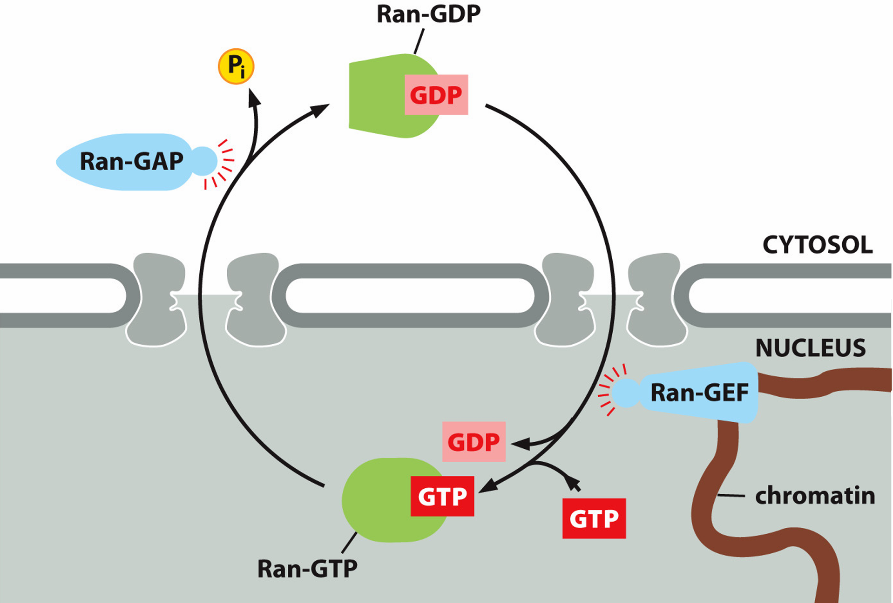

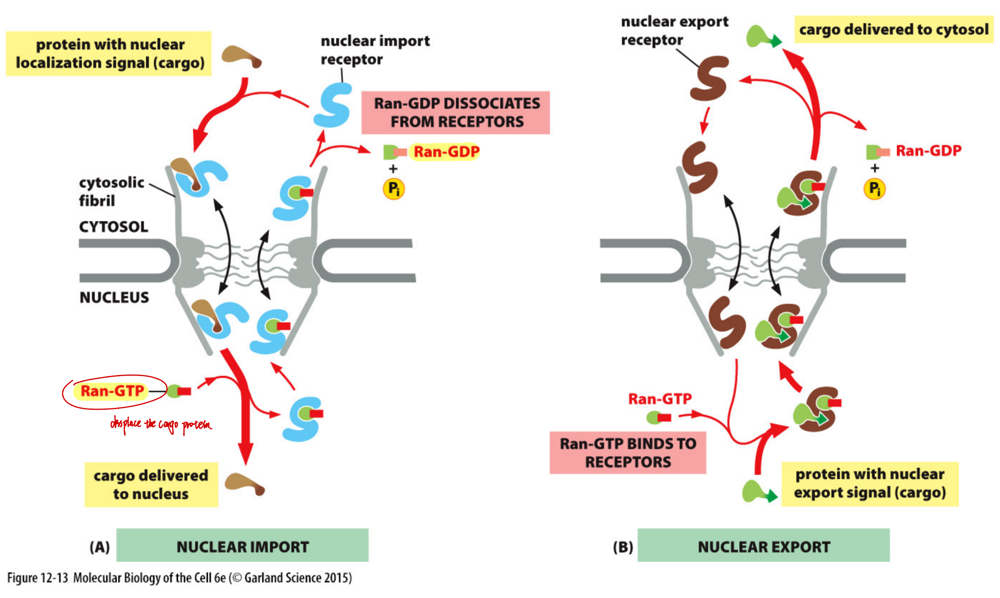

## Mitochondrial transport

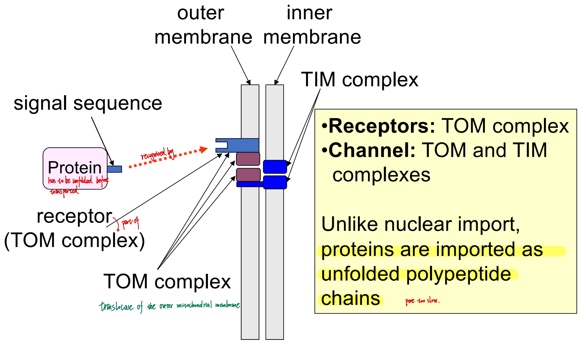

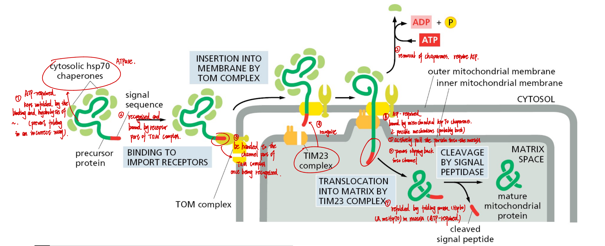

- hsp 70: part of import ATPase

**Steps**
1. The protein is kept unfolded by the binding and hydrolysis of cytosolic hsp70 chaperones (an ATPase).
2. The signal sequence is recognised. The protein is bound by the receptor part of the TOM complex.
3. The protein is handed to the channel part of TOM complex and inserted to the membrane.
4. TIM complex recognises the signal sequence.
5. The cthsp70 at peptide tail out side the mitochondrion is removed by ATP hydrolysis.
6. The signal sequence is cleaved by a protease.
7. The peptide head is transfered to the mitochondrial matrix by mitochondrial hsp70 chaperones. 2 possible mechanisms (probably both):
   - mthsp70 actively pull the protein into the matrix
   - mthsp70 prevent it from slipping back into the channel
   ❗Translocation across the inner membrane requires the electrochemical gradient.
1. Protein is refolded inside the matrix by folding protein (hsp60). This process is ATP-required.

### Energy requirement

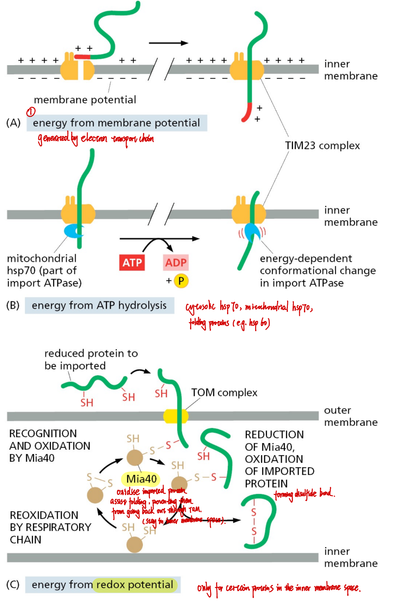

### Insertion of membrane proteins into the outer mt mrmbrane

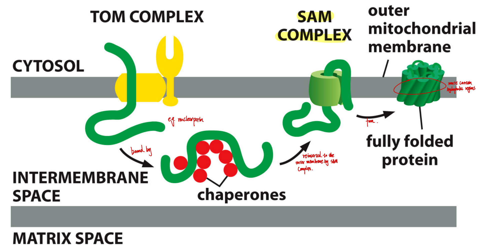

Bound by chaperones and reinserted to the SAM complex. Move laterally out of the complex.

### Insertion of membrane proteins into the inner mt mrmbrane

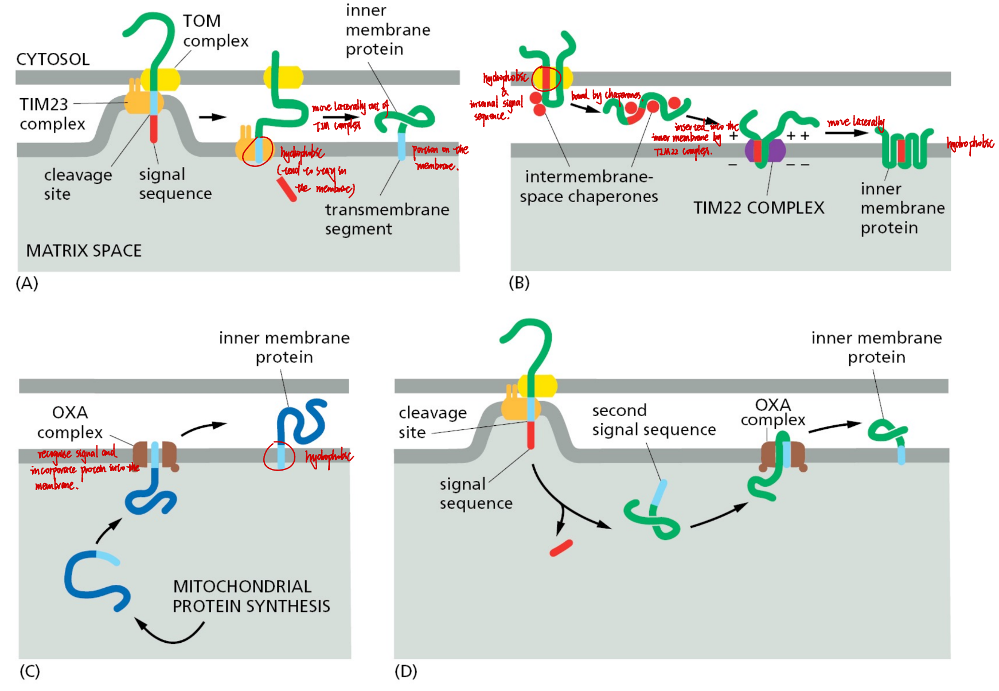

1. Move laterally out of the TIM complex directly.
2. Bound by chaperones, resinserted to TIM complex, and move laterally out of the complex.
3. The protein is synthesised in matrix / after the protein has been transfered into the matrix: OXA complex recognises the signal and incorporate the protein into the inner membrane.

------

## Endoplasmic reticulum transport

Typical ER signal sequence: 

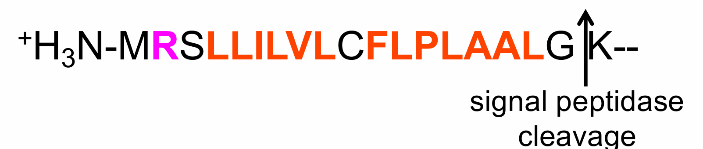

**ER translocation can be co- or post translational, and SRP-dependent or -independent**

### SRP pathway

**Structure of SRP**
6 proteins + 1 small RNA molecule

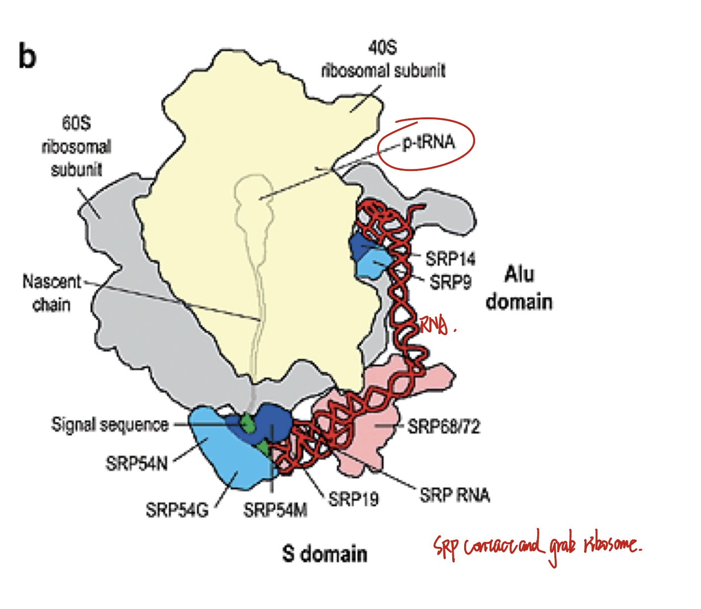

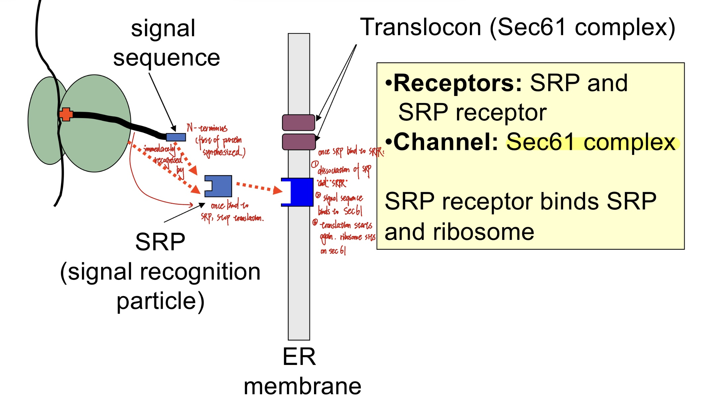

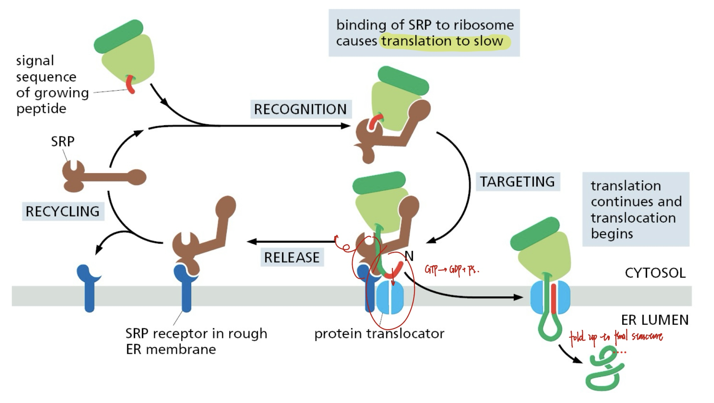

#### Steps

1. The signal sequence is on the N-terminus (first of protein synthesised). It is immediately recognised and bound by SRP.
2. Once the protein is bound by SRP, it stops translation.
3. Once SRP binds to SRPR:
   (1)  SRP and SRPR dissociate from the protein, and the signal sequence binds to the sec61 complex. Both are powered by GTP hydrolysis.
   (2) Translation starts again. Ribosome sits on sec 61.

---

### sec62/63 pathway

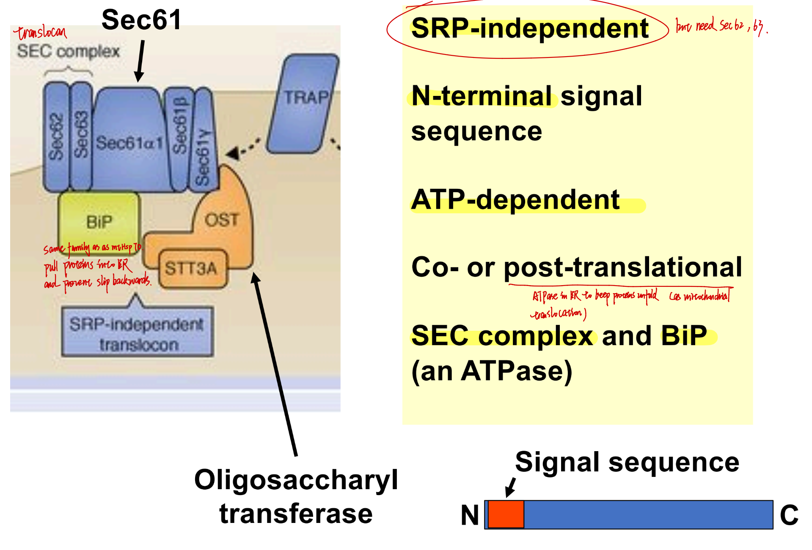

-------

### TRC40 pathway

------

### Comparison between different pathways

|                     | SRP              | sec62/63                                                                     | TRC40                                                                              |
| ------------------- | ---------------- | ---------------------------------------------------------------------------- | ---------------------------------------------------------------------------------- |
| Component           | SRP, SRPR, sec61 | SEC comlpex (import: sec62/63, channel: sec 61), BiP (as mthsp70, an ATPase) | TRC40, TRC40R                                                                      |
| Energy-dependent    | GTP              | ATP                                                                          | ATP                                                                                |
| Translational state | co-translational | co- or post-translational  (chaperones in ER keeps proteins unfolded)     | post-translational                                                                 |
| Signal sequence     | N-terminal       | N-terminal                                                                   | C-terminal TMD (transmembrane domain) / GPI (glycosylphosphatidyl inositol) anchor |
| Specifity           | /                | /                                                                            | membrane proteins                                                                  |
| Alternative         | /                | /                                                                            | GET pathway in yeast                                                               |

------

### Translocation into the ER lumen

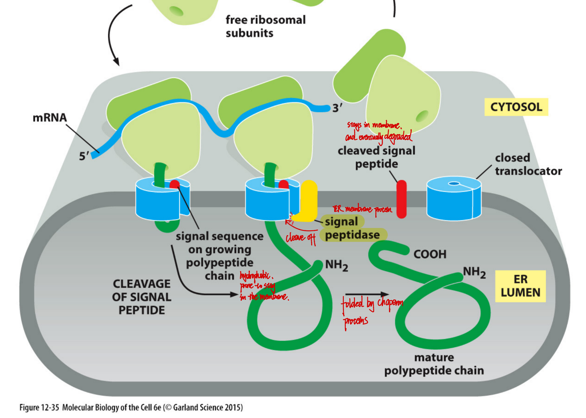

### Translocation into the ER membrane

#### 1. Single-spanning membrane protein

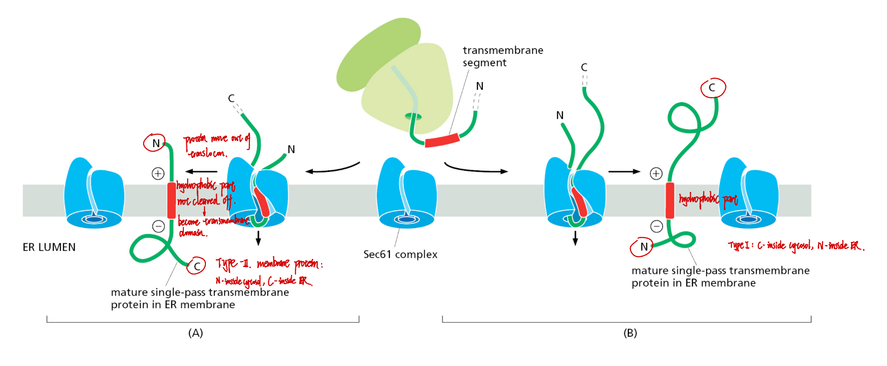

#### 2. Multiple-spanning membrane protein

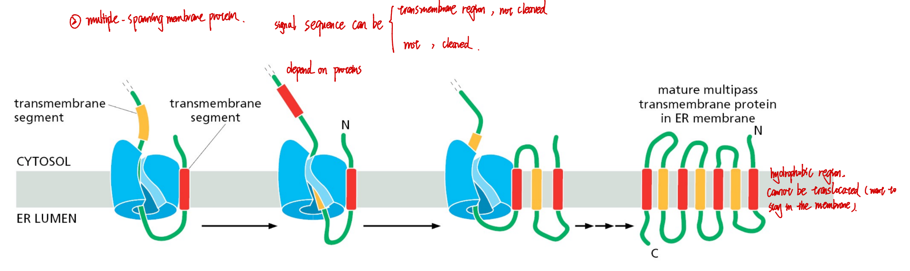

### N-linked glycosylation in ER

N = asparigine, at N-X-S or N-X-T, where X can be any amino acid except for proline.
1. Oligosaccharyl transferase (ER-membrane protein that sits beside sec61) recognises asparigine in the growing polypeptide chain.
2. It interacts with ribosome and glycosylate (transfer sugars from the lipid-linked oligosaccharide to) the asparigine side chain.

------

### ER-associated degration

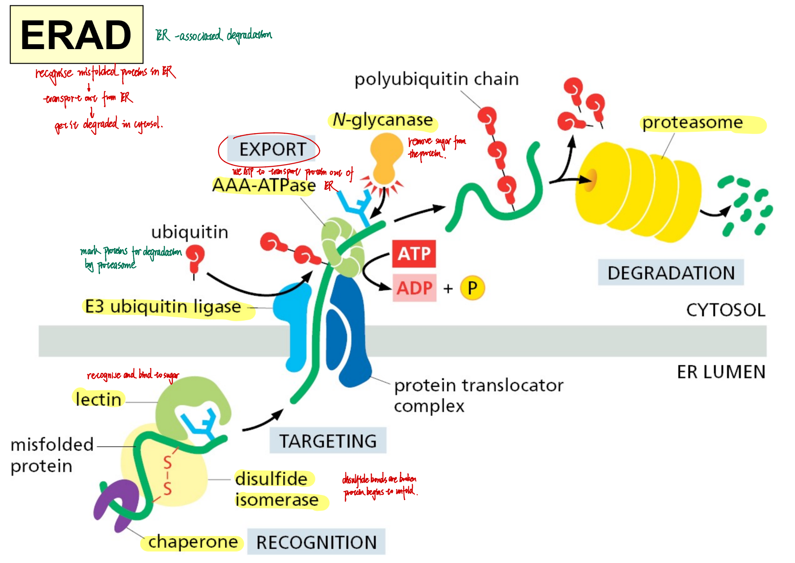

1. Chaperone catches the misfolded protein
2. Disulfide isomerase: disulfide bonds are broken → protein begins to unfold
3. Lectin: recognises and binds to sugar
4. E3 ubiquitin ligase: adds ubiquitin chain → marks proteins for degradation by proteasome
5. AAA-ATPase: uses ATP to transport protein out of ER
6. N-glycanase: removes sugar from the protein
7. Polyubiquitin chain guides the protein to the proteasome
