[12,13. Protein import into organelles](<12%2C13.%20Protein%20import%20into%20organelles.md>)

Phosphoinositides mark organelles and membrane domains.

## Vesicle sorting proteins

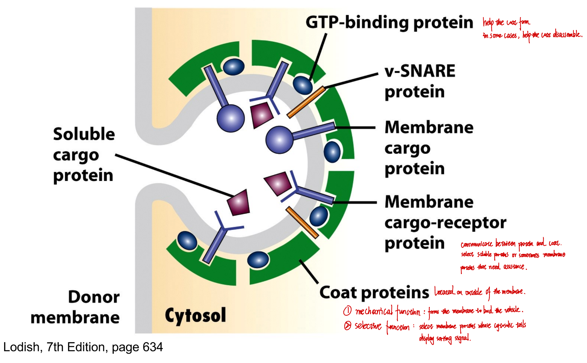

### Coat proteins

#### Mechanical function: 

Deform membrane to generate vesicles
- Induce membrane curvature
- Concentrate force to bud vesicles

#### Selective function:

Cargo selection and sorting

| Vesicle type | Coat proteins                                      | Assiciated GTPase |
| ------------ | -------------------------------------------------- | ----------------- |
| COPII        | SEC complexes                                      | Sar1              |
| COPI         | Coatomers                                          | ARF               |
| Clathrin     | Clathrin + adaptor proteins (e.g. AP1/2 complexes) | ARF               |

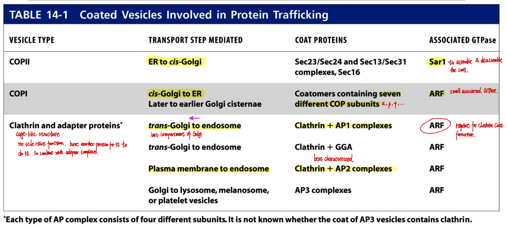

- The GTPases ARF and Sar1 control coat recruitment.
- They also control disassembly of COPI and II coated vesicles.
- Uncoating of clathrin-coated vesicles requires an Hsp70 family ATPase.

### Assembly and disassambly of a coated vesicle

e.g. A clathrin coated vesicle

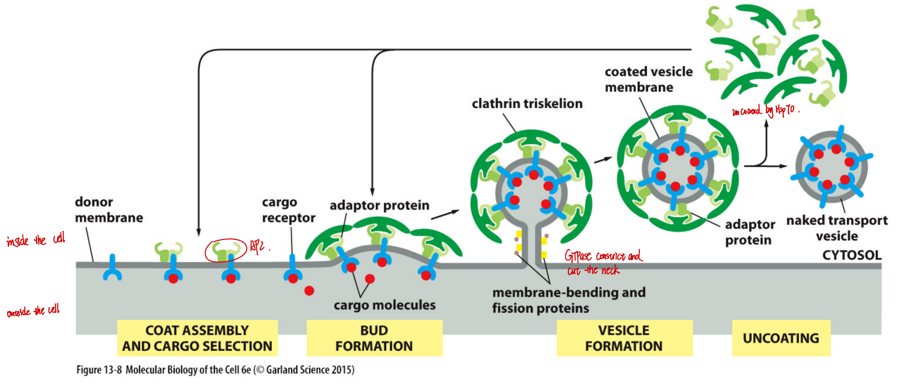

- The clathrin-coated vesicle is pinched off by a GTPase called dynamin during endocytosis.

------

## Membrane fusion

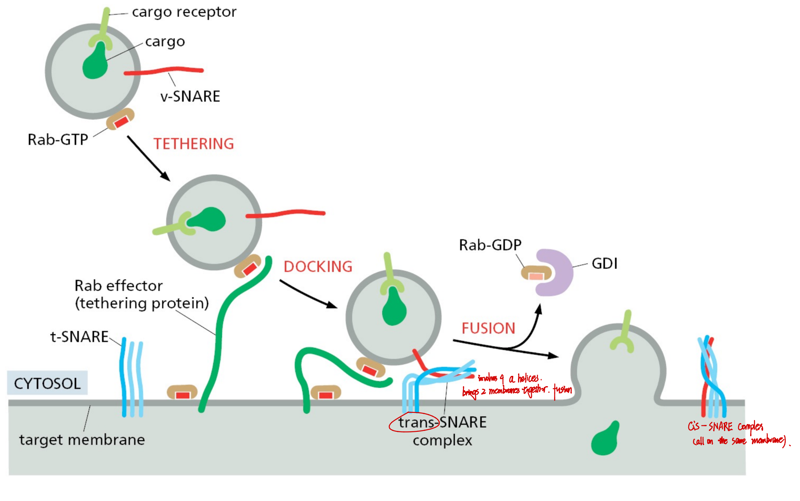

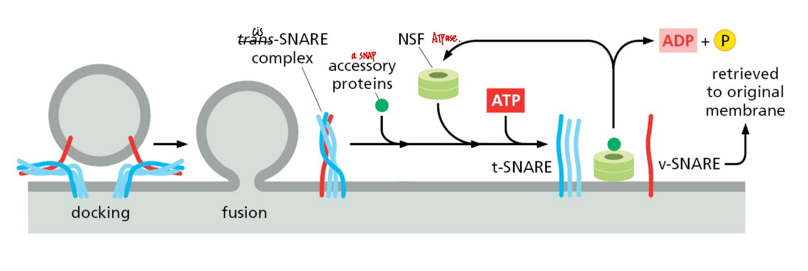

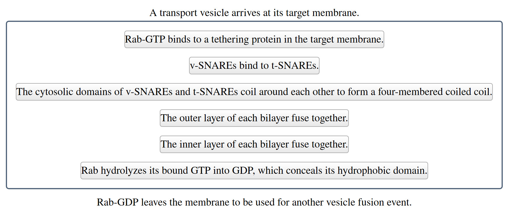

### Rab proteins and SNAREs

- Each fusion has different Rabs and different combinations of SNAREs
-  Docking begins when Rab-GTP binds to a tethering protein in the target membrane. A tethering protein is a flexible protein that establishes a loose physical connection between the vesicle and the target. The loose association between vesicle and target that is established during docking allows the proteins that are involved in vesicle fusion to interact with each other.

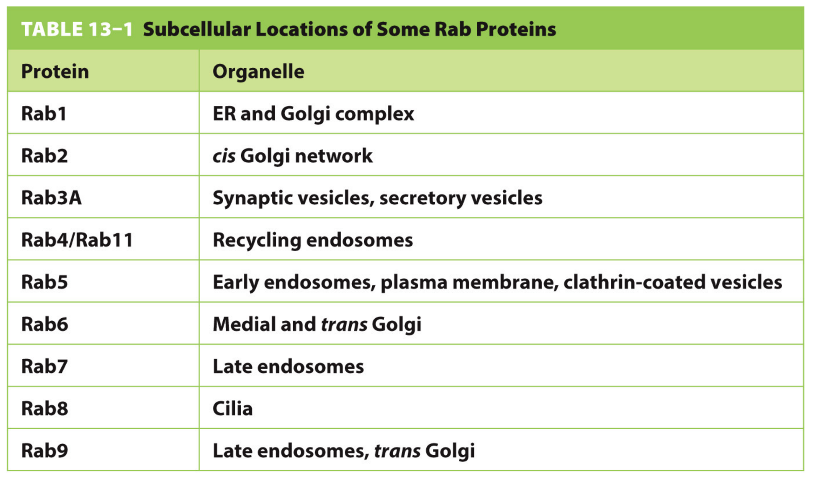

-----

## Protein trafficking

### 1. Soluble ER resident protein

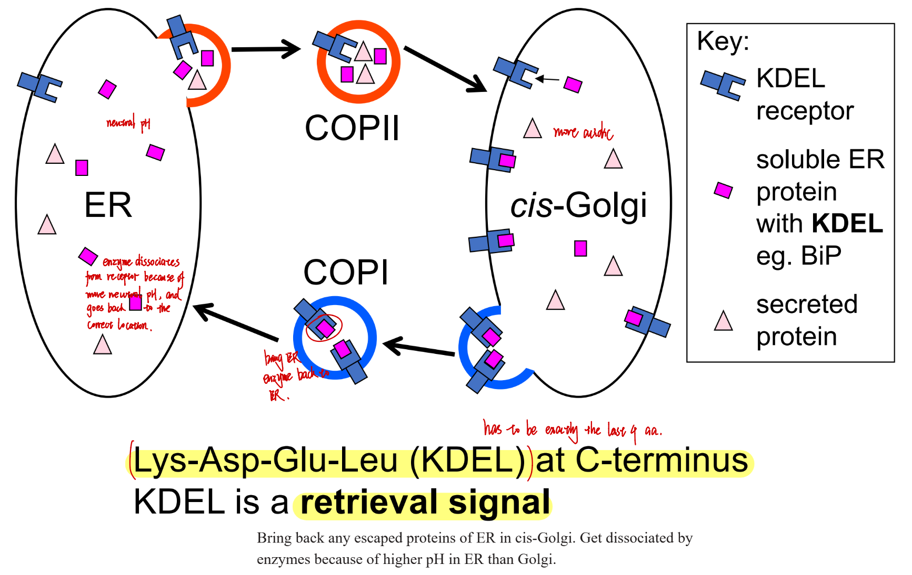

### 2. Transmembrane ER resident protein

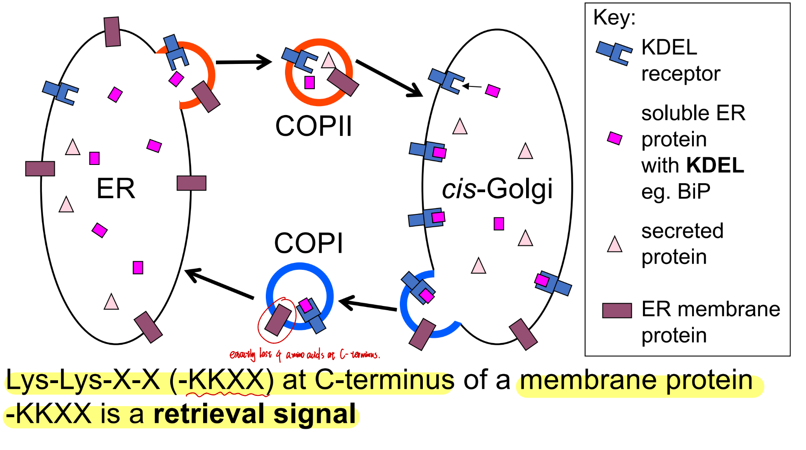

### 3. Soluble lysosomal resident proteins

- Mannose 6-phosphate is added to sugars on hydrolase in the cis-Golgi
- On reaching the trans-Golgi, the M6-P is recognised by the M6-P receptor.
- Hydrolase  and receptor are sorted to endosomes by vesicles.
- Hydrolase is delivered to lysosome and is activated by proteolysis and low pH.

### 4. Secretion by exocytosis

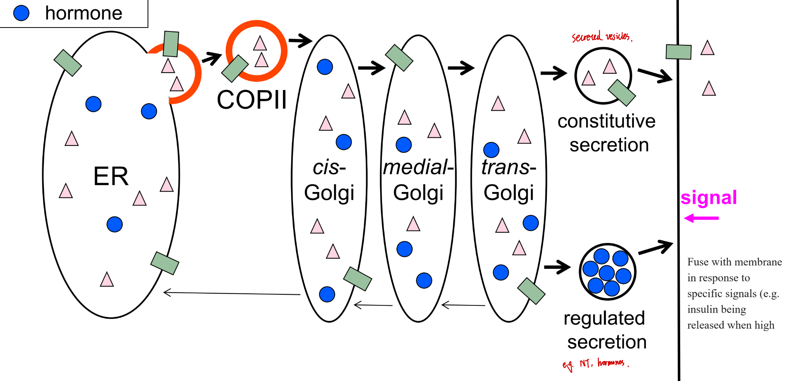

### 5. Endoyctosis

#### 1) Low density lipoprotein (LDL) 

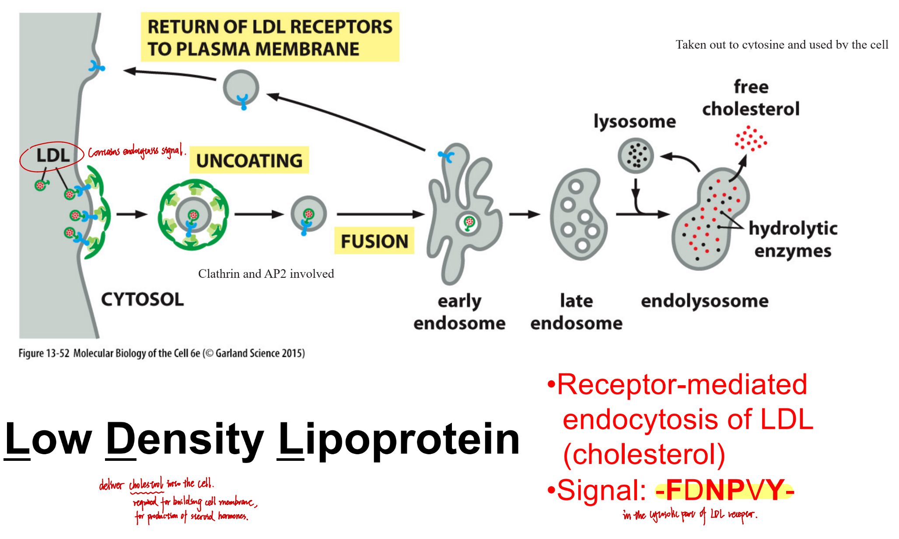

#### 2) Epidermal grwoth factor (EDF)

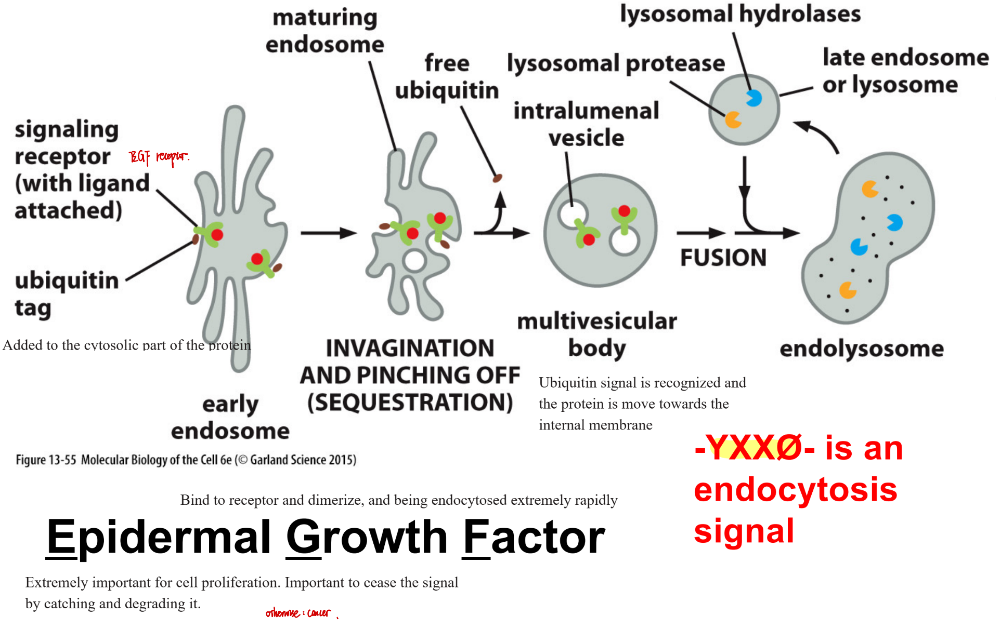

----

## Protein transport and modifications in Golgi

### Models for protein transport in Golgi

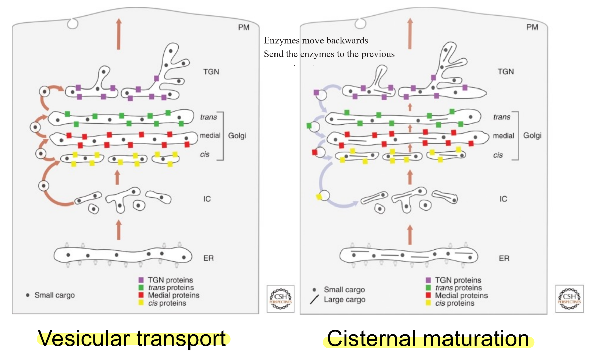

### O-linked glycosylation in Golgi

--------

## Sorting at late endosomes (multivesicular bodies)

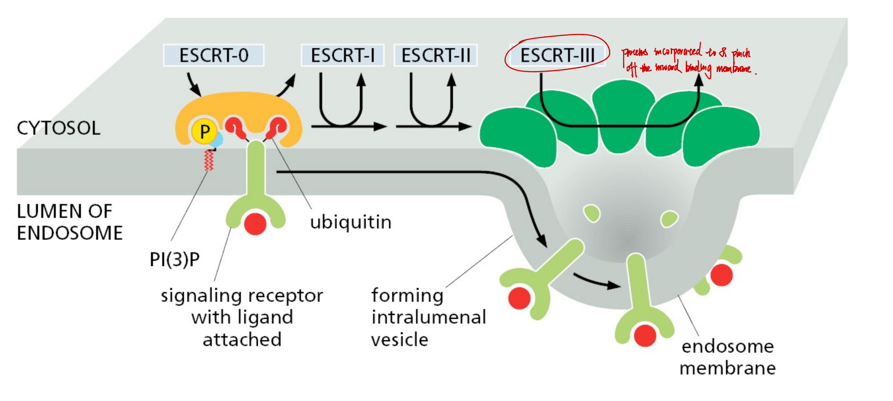

- Ubiquitin: signal for sorting at MVB.
- ECRT-III proteins incorporate to & pinch off the inward binding membrane.

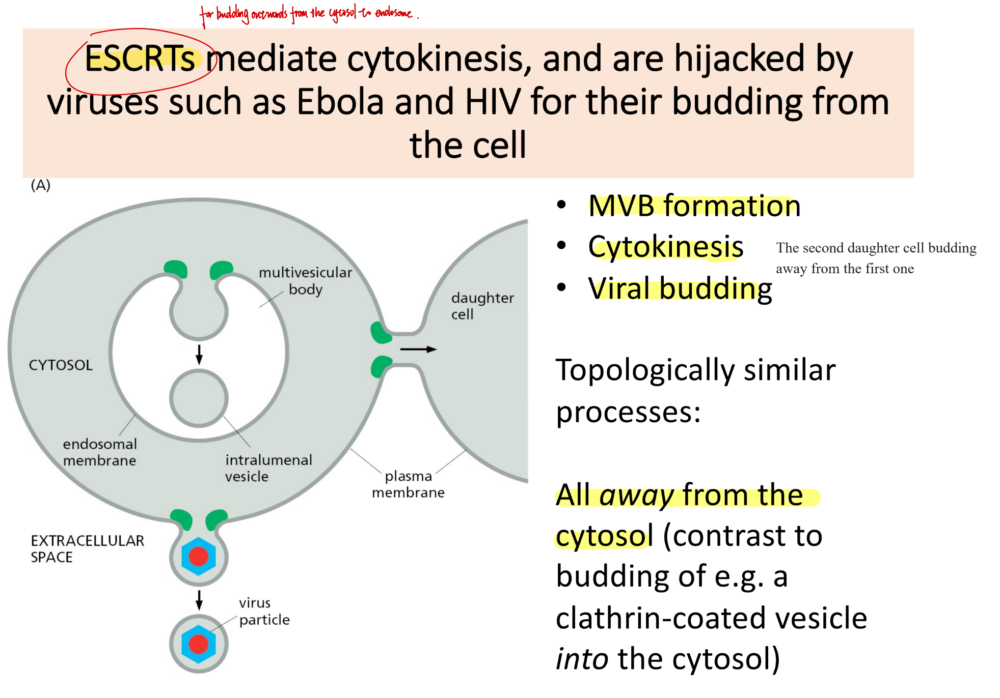

### Viruses exploit protein trafficking pathways

