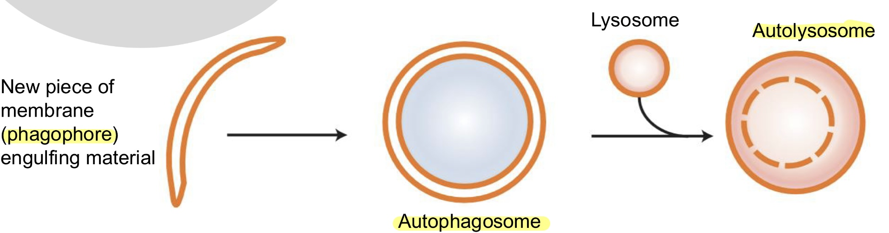

## Autophogy

## mTOR

= Target of rapamycin. 
- A serine/threonine (contain -OH group) protein kinase
- Promote cell growth
- Conserved throughout all eukaryotes
- Functions in 2 different complexes (mTORC1, mTORC2). mTORC1 has a central role in cell growth control.

**Rapamycin**
- Isolated from soil bacteria 
- Antifungal properties
- Later found to be immunosuppressive and cytostatic (inhibiting cell proliferation)
