[5. DNA transcription](<5.%20DNA%20transcription.md>)

RNA processing only occurs in eukaryotes.

proportion of RNA in eukaryotes:
rRNA(80%)>tRNA(15%)>ncRNA(3%)>mRNA(2%)

## RNA polymerase in eukaryotes

| Polymerase  | RNA transcribed                                                                                                                  |
| ----------- | -------------------------------------------------------------------------------------------------------------------------------- |
| RNA pol I   | pre-rRNA (28S, 18S, 5.8S rRNAs)                                                                                                  |
| RNA pol II  | mRNA snRNAs (RNA splicing) siRNAs (translational control, chromatin-mediated repression) miRNAs (translational control) |
| RNA pol III | tRNAs 5S rRNA 7S RNA                                                                                                       |

------

## Location of RNA processing 

### Prokaryotes:

- No nucleus. All RNA processing in cytoplasm.
- mRNA has minimal processing: immediately go for translation and be degraded.

### Eukaryotes:

- In nucleus: mRNA, tRNA, 5S rRNA
- In nucleolus: 28S, 18S, 5.8S rRNAs
- In both nucleus and cytoplasm: sncRNAs (depends on type)

------

## mRNA processing

### mRNA processing is coupled to transcription in eukaryotes

RNA Pol II C-terminal domain (CTD) dynamic phosphorylation, coordinates mRNA processing with transcription.

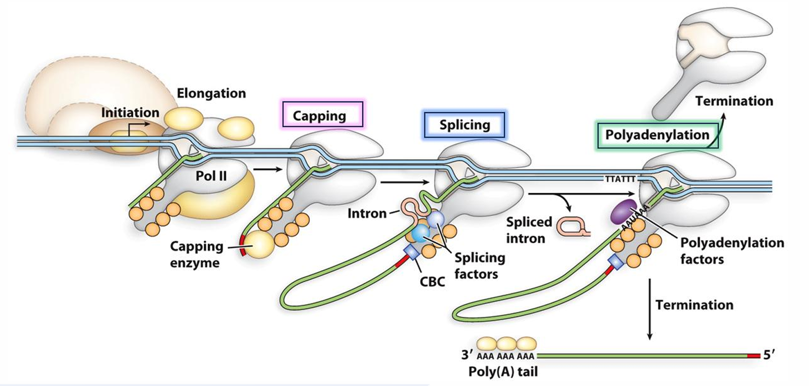

- Capping needed for transcription elongation 
- Polyadenylation needed for transcription termination 
- Between capping and polyadenylation, RNA pol II recruit proteins for RNA splicing

**Advantages** 
- Facilitates nucleus export 
- Enhances stability 
- Protects from degradation 
- Used as quality control mechanism

-----

### Types of mRNA processing

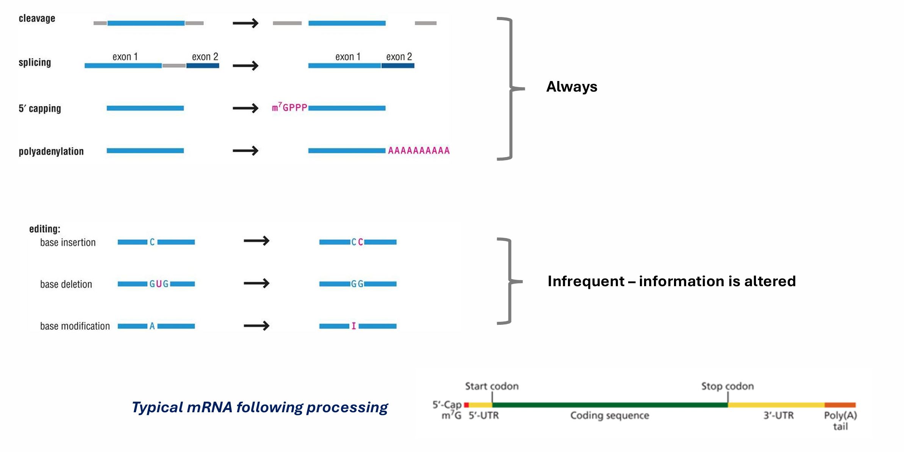

### 1st step: Addition of 5’ cap

1. Removal of outermost phosphate group by RNA triphosphatase 
2. Addition of Guanosine Monophosphate (GMP) by Guanylyl-transferase and creation of a 5’-5’ linkage 
3. Methylation of the Guanine Cap by Methyltransferase –crucial for mRNA export to cytoplasm and translation initiation

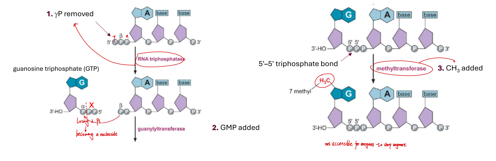

**The use of 5' cap**
- Protect the transcript from degradation
- Aid export of mRNA to the cytoplasm
- Direct protein translation initiation in the ribosome

-----

### 2nd step: Exon-intron Splicing

   = Removal of introns and fusion of exons
- Introns are excised and degraded 
- All intron removal mechanisms use transesterification reactions

#### Transesterification

Two transesterification reactions – exons joined in a two-step process
1. Two phosphodiester bonds are broken - replaced by two new phosphodiester bonds, of similar energy 
2. The intron is first detached from exon 1 then exon 1 reacts with exon 2

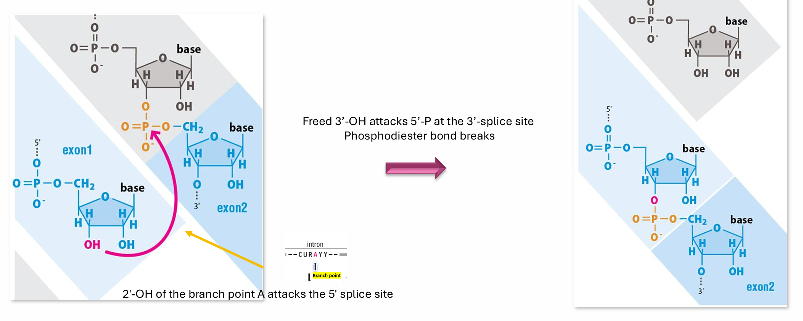

#### Splice sites

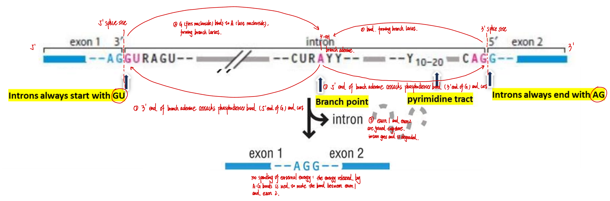

- Mammalian splice recognition exon-intron boundary sequence: 5’ GU – 3’ AG 
- Branch point intron nucleotide – results in formation of a branch lariat 
- Polypyrimidine tract, located before 3' AG
- Other recognition sequence landmarks that allow production of mRNA isoforms

#### Spliceosome machinery

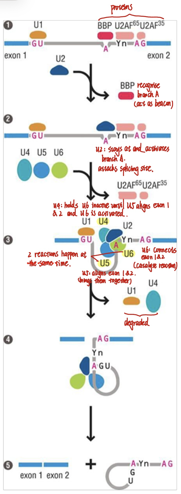

Complex of 5 snRNPs (U1, U2, U4, U5, U6). Each snRNP has a ~100-300nt snRNA + proteins 

**Binding steps:** 
1. U1 binds 5′ GU 
2. BBP recognises and binds to branch point "A" 
3. U2AF (U2 auxillary factor) 65 binds poly-pyrimidine tract 
4. U2AF35 binds 3’ AG remaining components assemble around, frequently displacing previously bound components 

**Splicing reactions:** 
1. U2 displaces BBP 
2. U4-U5-U6 complex displaces U2AF complex 
3. U1 and U4 are released 
4. First transesterification occurs – exon 1 released 
5. Intron lariat intermediate forms 
6. Rearrangements bring together the freed exon 1 and intron/exon 2 junction 
7. Second transesterification occurs – two exons are joined 
8. Lariat intron released

#### Alternative splicing

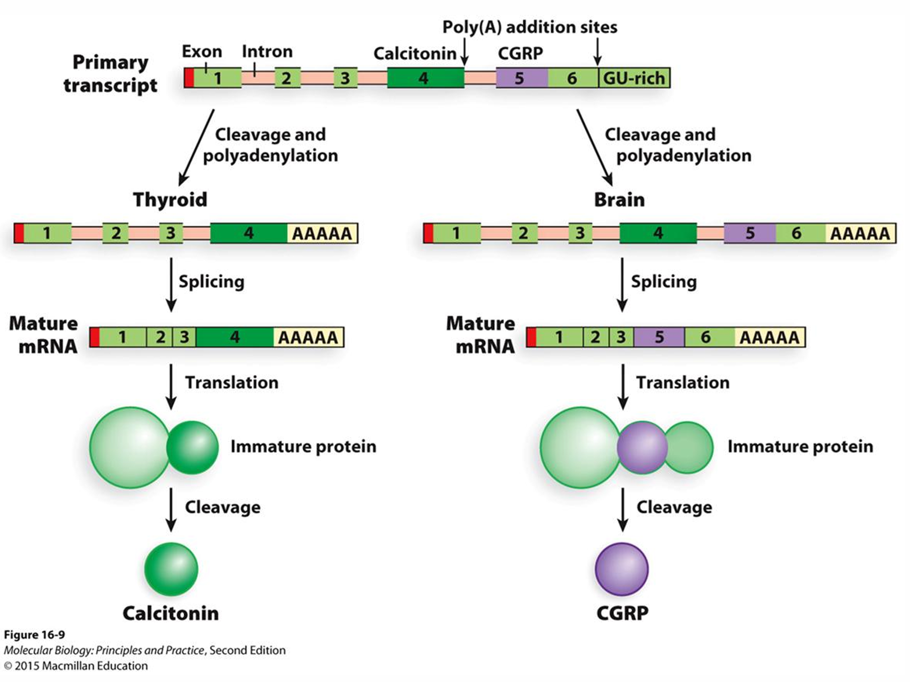

- 90% of mRNAs generate isoforms 
- Enables a gene to generate >1 products 
- Also exon shuffling: exons are rearranged, duplicated, or inserted into new genetic contexts, creating new genes or new protein functions.

------

### 3rd step: Addition of 3’ poly(A) tail

**Steps** 
1. Polyadenylation factors bind the poly(A) signal, initiating mRNA cleavage.
2. 3’ cleavage by an endonuclease complex, at the “polyA” signal.
3. Addition of ~200 As by poly(A) polymerase (PAP).
4. Poly(A) binding protein (PABP) protects tail.
No template is involved.
poly(A) signal: AAUAAA

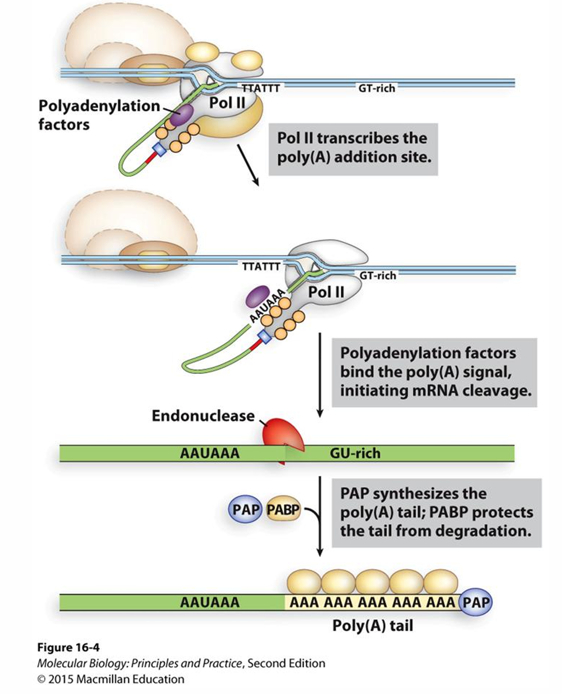

-----

## tRNA processing

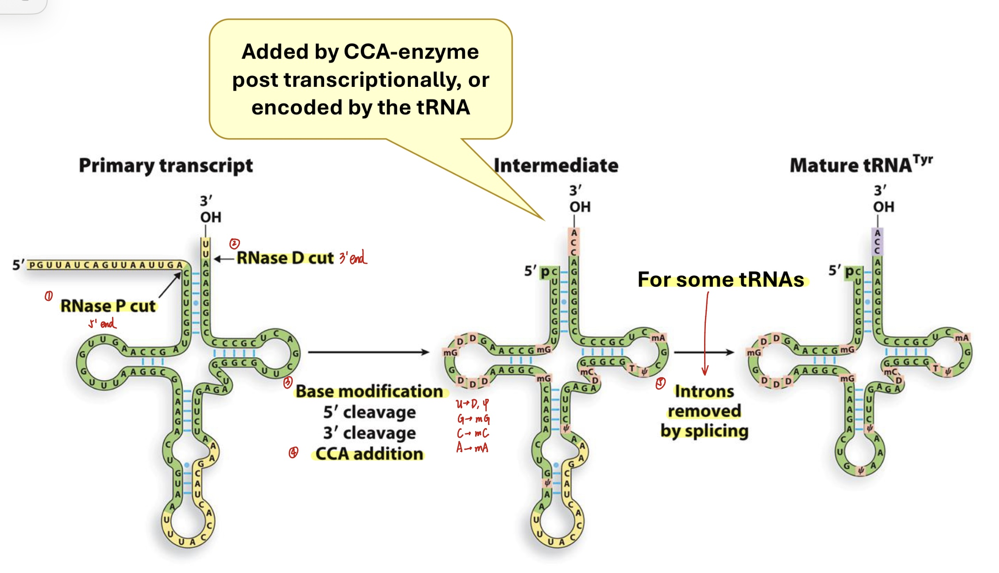

tRNAs are synthesized as longer precursors, processed into smaller functional parts

---

## rRNA processing

multiple pathways to produce a single ribosome subunit (redundancy)
Reason: probably due to evolutional advantage (ribosome is important)
Steps: coordinated 
Location: Nucleolus (processing + assembly) 
Intron removal: If present -Self spliced 
Post-transcriptional: nucleotide modifications, by small nucleolar RNAs (snoRNAs) 
Example: S. cerevisiae rRNA processing Excision of bacterial rRNAs is performed by RNase III

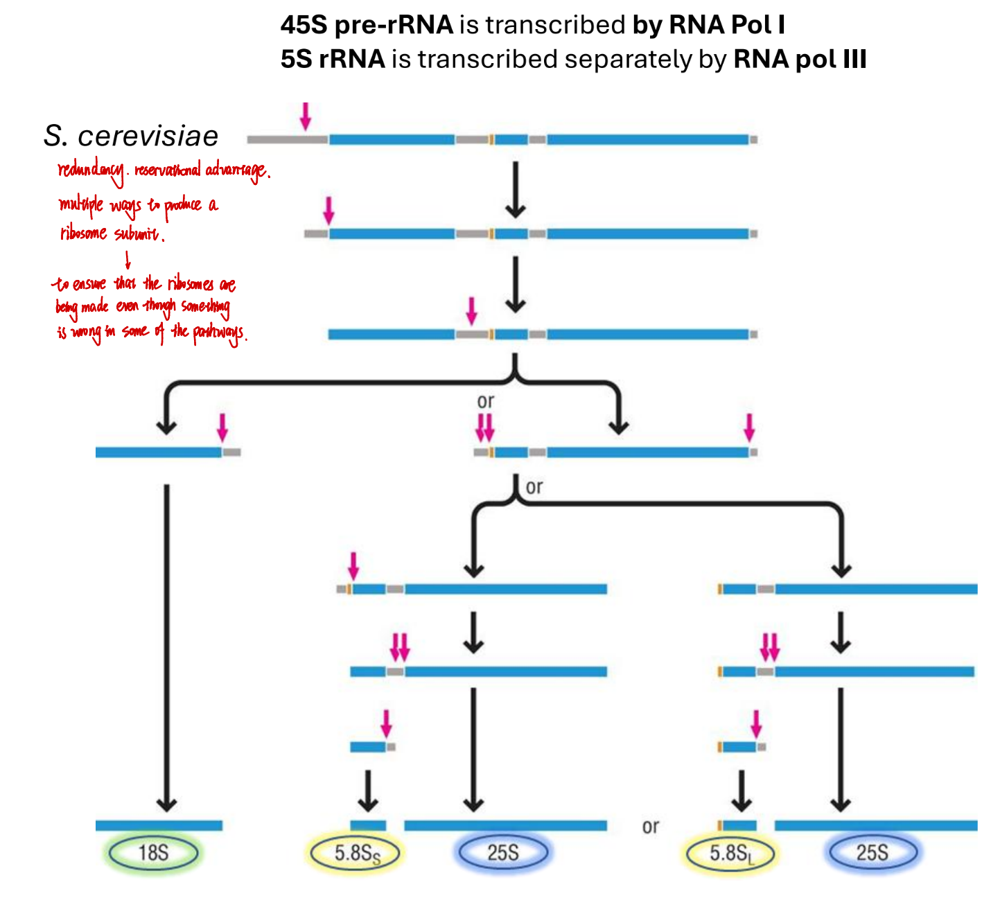

----

## RNA processing errors and disease

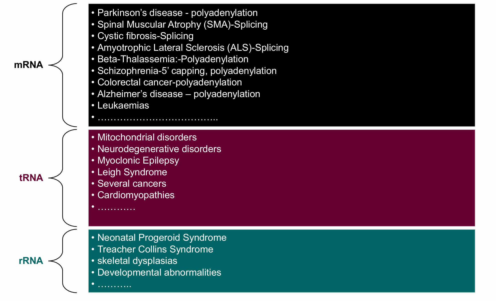
