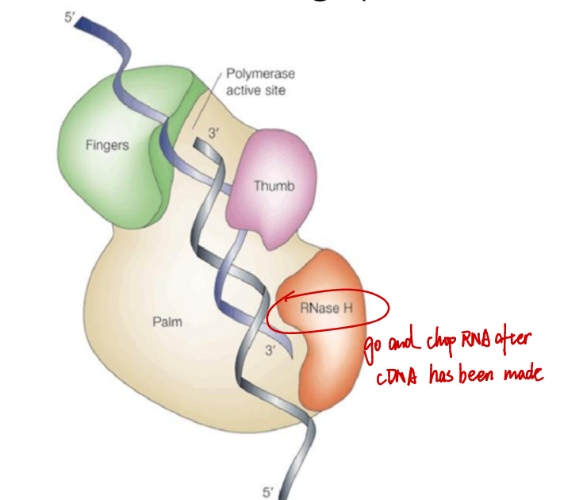
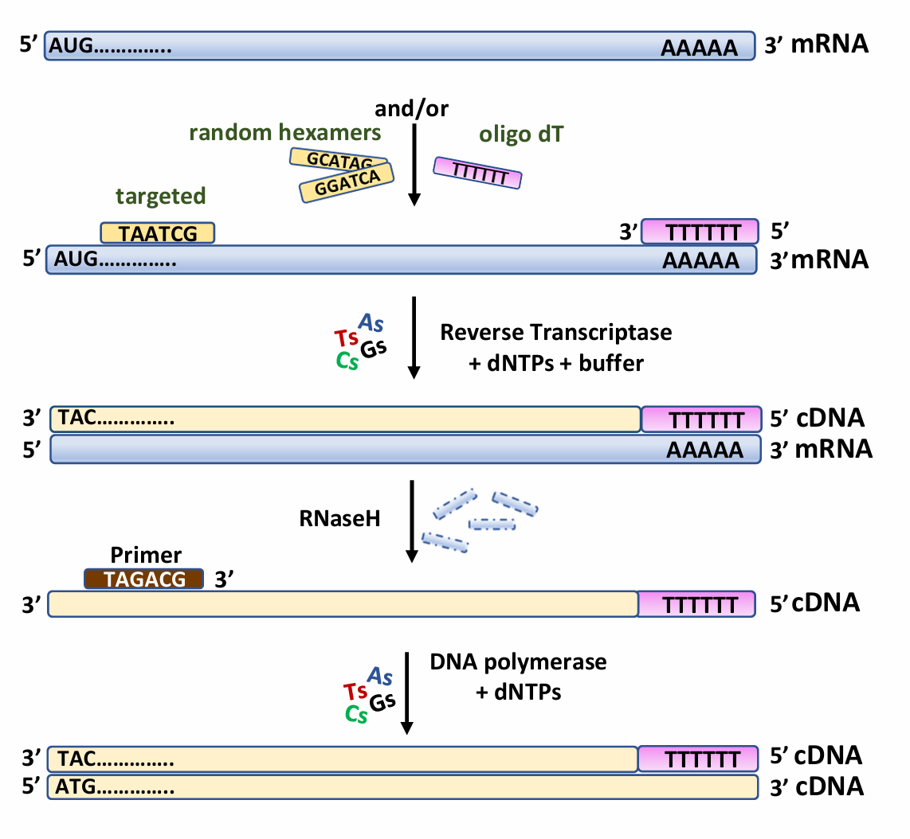
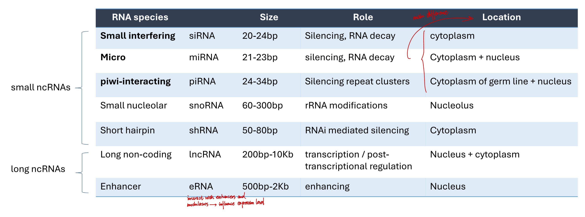
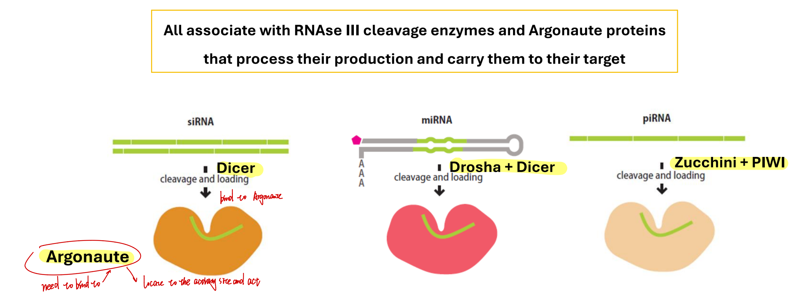
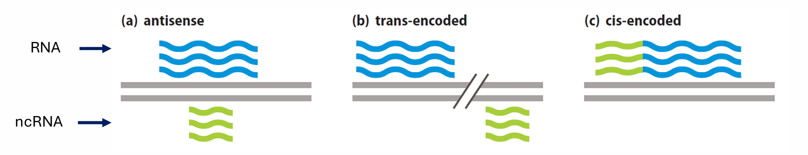
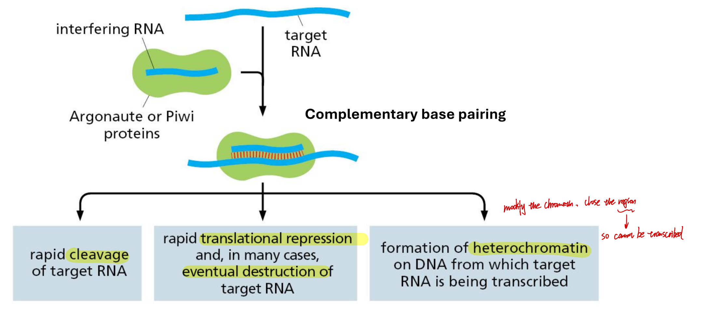
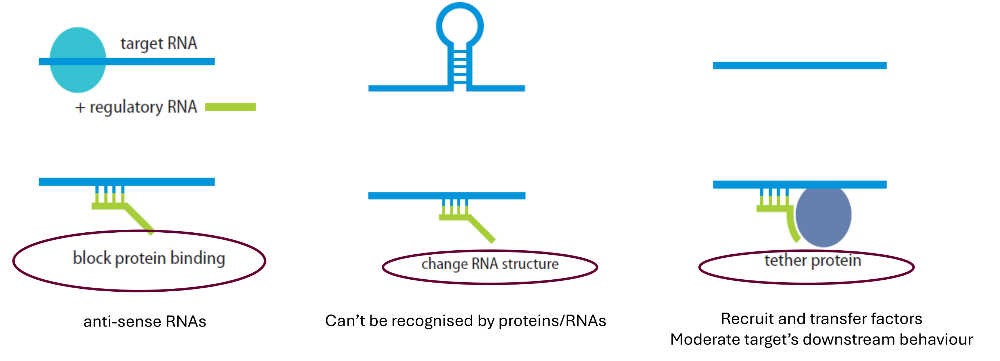
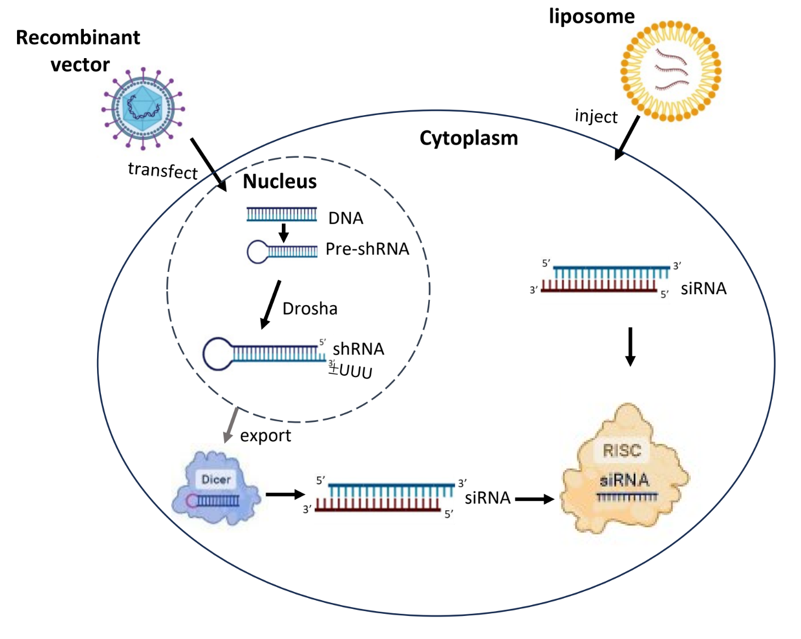
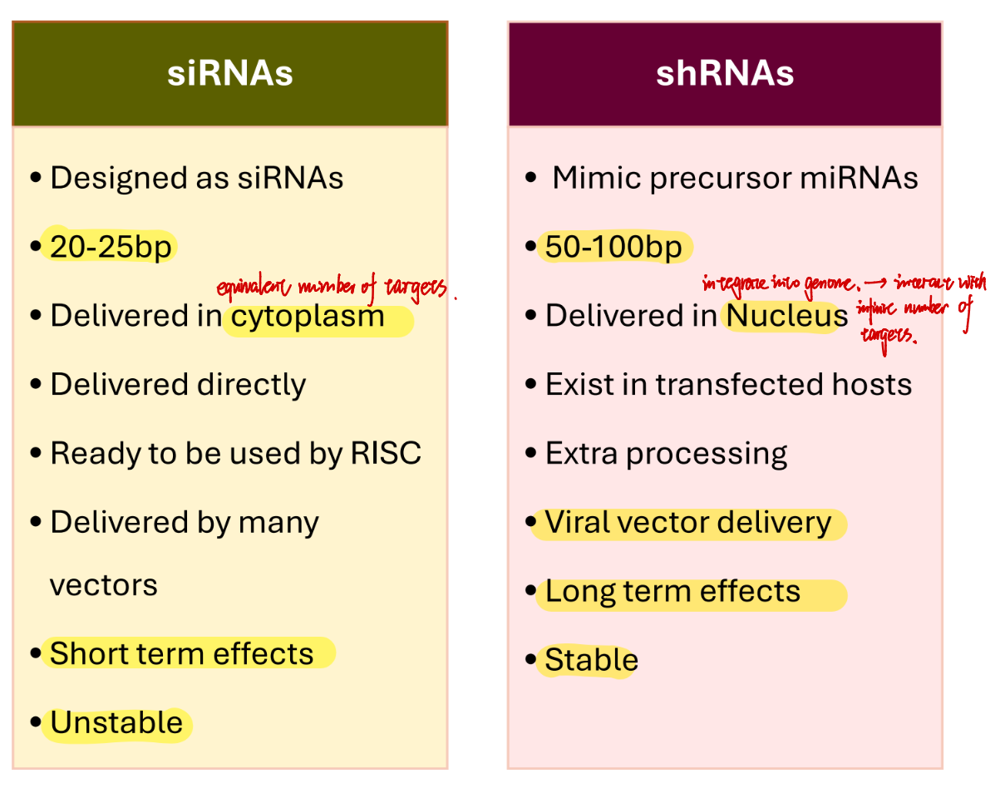

## Reverse transcription

### Reverse transcriptase

Typically encoded by:
- Viruses (identified from a chicken virus) 
- Eukaryotic retrotransposons 
- Telomerase (enzyme that directs telomere length)

### cDNA synthesis

1. Heat RNA to ~65°C for ~10mins 
2. Oligo d(T) and targeted/random hexamers hybridise (~25-40°C) 
3. RT synthesises complementary cDNA (~ 42°C) 
4. RT inactivated at ~85°C for ~10mins
5. mRNA:cDNA duplex unwound (by RT, or NaOH) 
6. RNA is degraded by RNaseH 
7. Random/targeted primer is added 
8. DNA polymerase with dNTPs synthesise 2nd cDNA strand
   ❗cDNA is very fragile, so cDNA need to be connected into double-stranded in lab to operate.

------

## Regulatory non-coding RNAs (ncRNAs)

### Classifications

- **siRNAs**: derived from dsRNAs (e.g., viral or transposons), by Dicer
- **miRNAs**: derived from endogenous longer primary RNAs (transcribed by Pol II), by Drosha, and is further modified by Dicer
  It binds to 3'UTR of the target mRNA and silences it.
  siRNAs and miRNAs regulate stability and translation of >50% human protein-coding genes 
- **piRNAs**: derived by processing long repetitive piRNA clusters (transcribed by Pol II), control germ line transposable elements
  Often complementary to transposon DNA.

### ncRNA location in relation to their targets

sncRNAs can be encoded in different ways with respect to their target: 
(a) on the DNA strand antisense to the target 
(b) in a completely separate DNA region (trans) 
(c) as part of the target (cis)

### Functions of ncRNAs 

#### 1. Inhibit expression of homologous target genes in three ways:

Regardless of function and route followed, mechanism remains the same

#### 2. Different ways of ncRNAs to interact with targets by base pairing

### RNAi mechanism

A natural process for most organisms, where sncRNAs cause sequence-specific gene silencing

**Steps**
1. sncRNAs precursors are formed 
2. Cleavage enzymes mediate sncRNA construction 
3. sncRNAs are transferred to cytoplasm (mainly by exportin-5) 
4. Argonaute proteins + sncRNAs = RISC (RNA-induced silencing complex) 
5. RISC binds to RNA target 
6. RISC cleaves and degrades RNA target 
7. Gene is silenced and keeps being silenced for as long as RISC is present

### Comparison between induced RNAi using shRNAs or siRNAs

### siRNA delivery

Delivery vector of siRNA: liposomes, micelles, peptides, nanoparticles
Encapsulation of siRNAs into the naked nanoparticles so far seems to work best.

Vector qualities: 
- High efficiency 
- Target specificity 
- Ability to monitor transfection levels 
- Cellular uptake 
- Delivery in a wide range of cell types 
- Minimum toxicity and immunogenicity 
- Safety measurements
