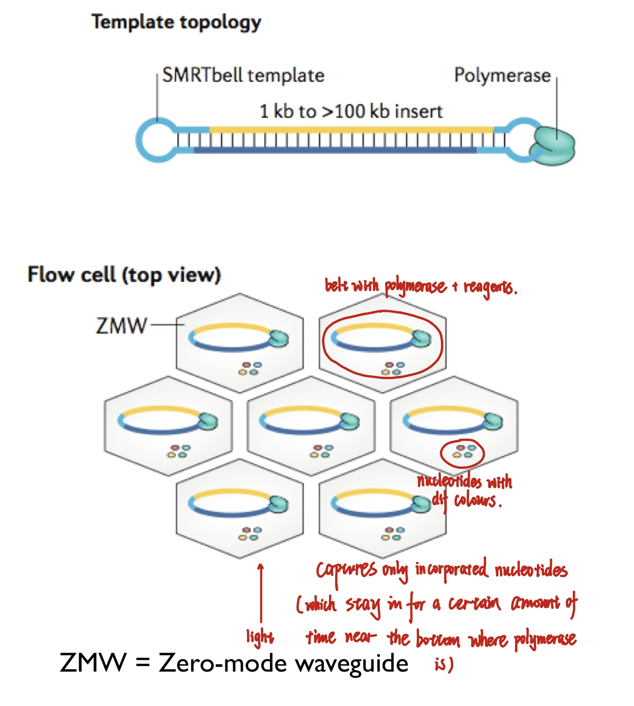
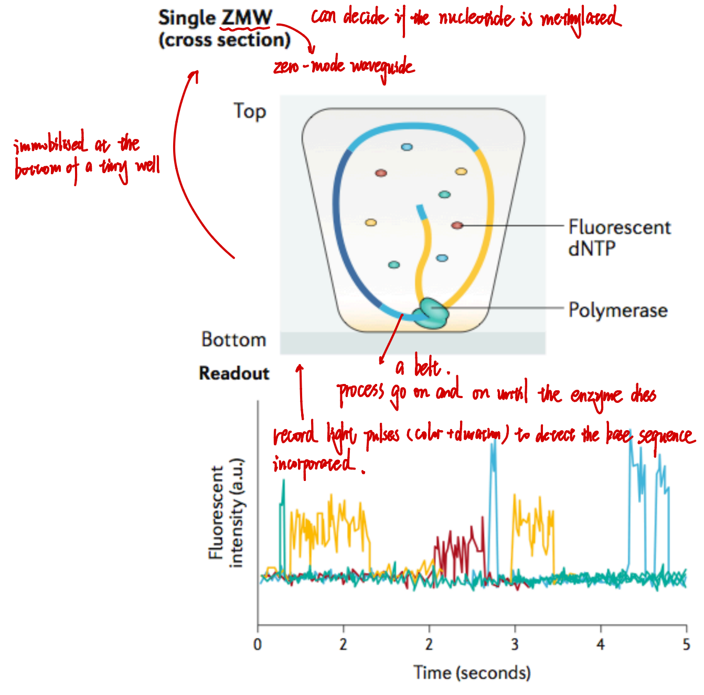
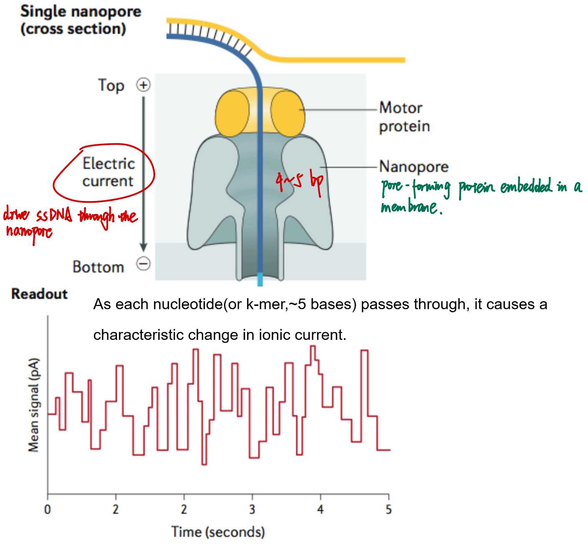

Can sequence 20 kB and sometimes even the whole chromosome

----

## SMRT (single-molecule, real-time) sequencing

---

## Nanopore sequencing / Oxford nanopore technologies (ONT)

----

Useful literature
Mardis, E. R., Next generation DNA sequencing methods. Ann. Rev. Genomics Hum. Genetics 2008, 9: 387-402
