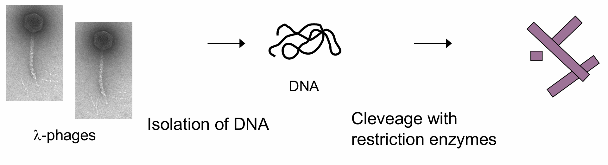
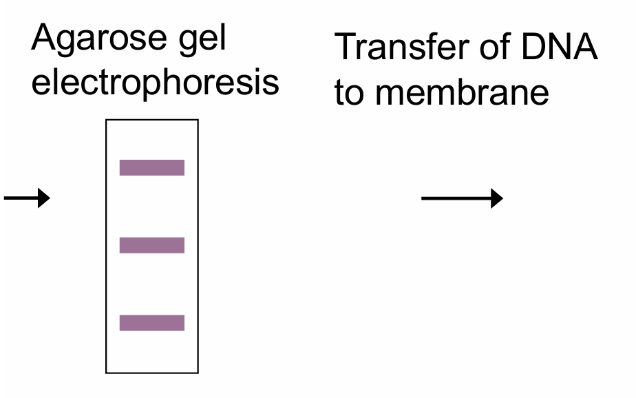
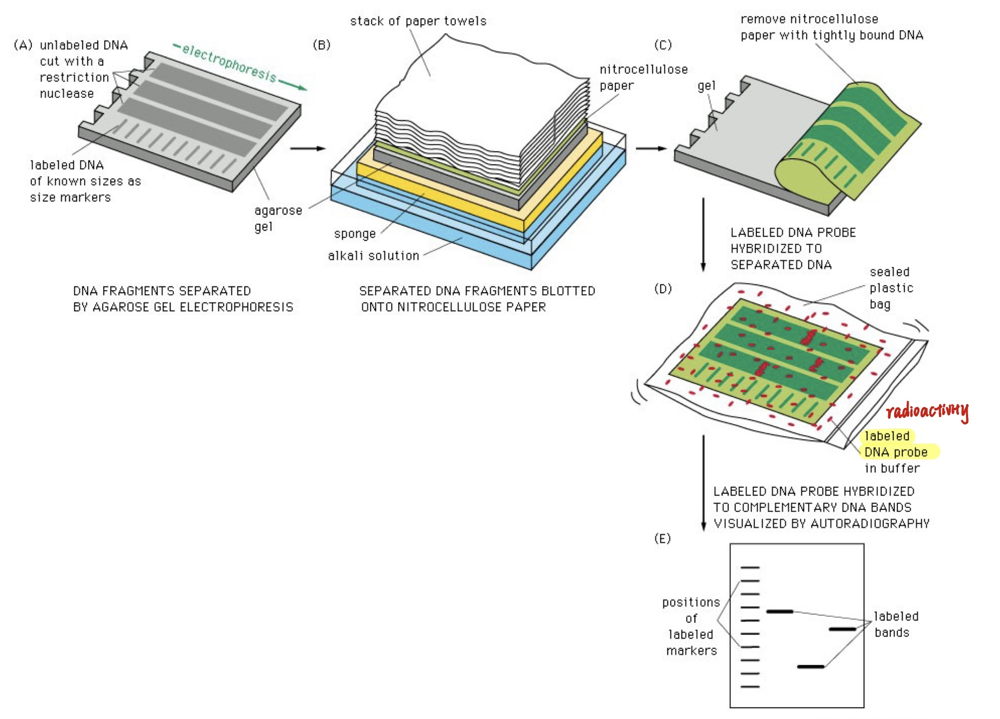
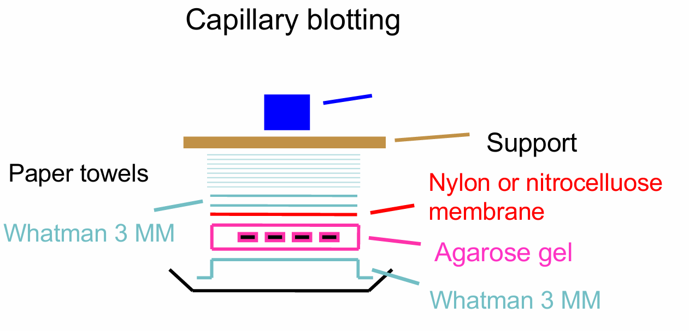
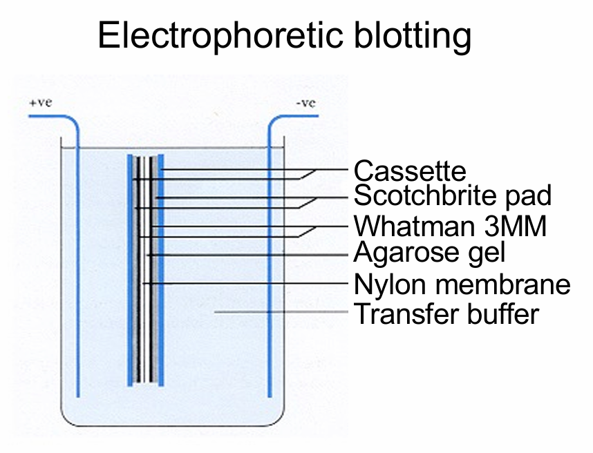
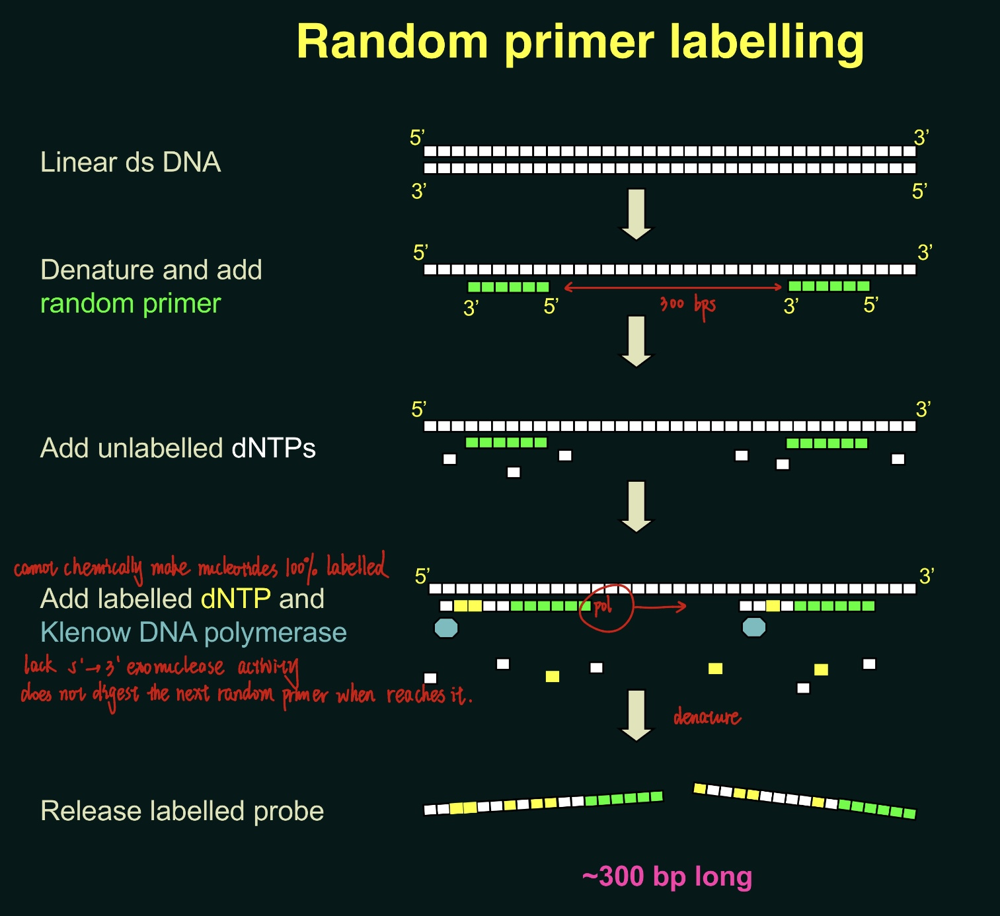
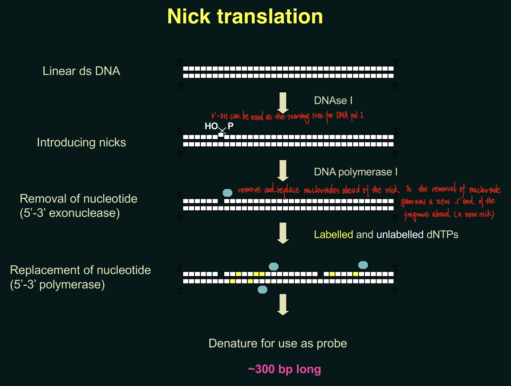
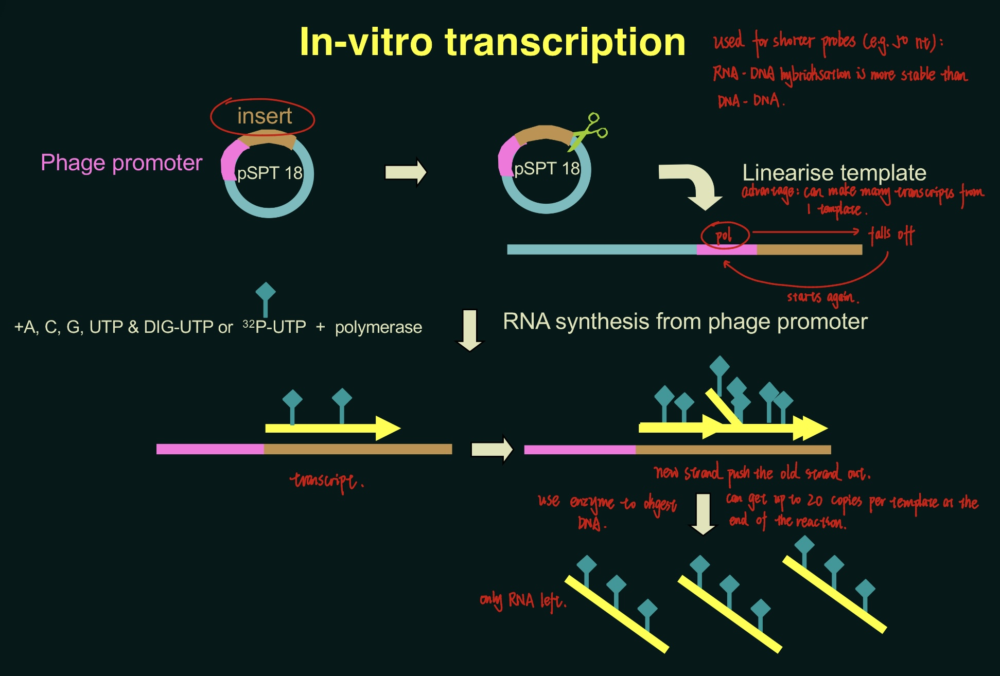
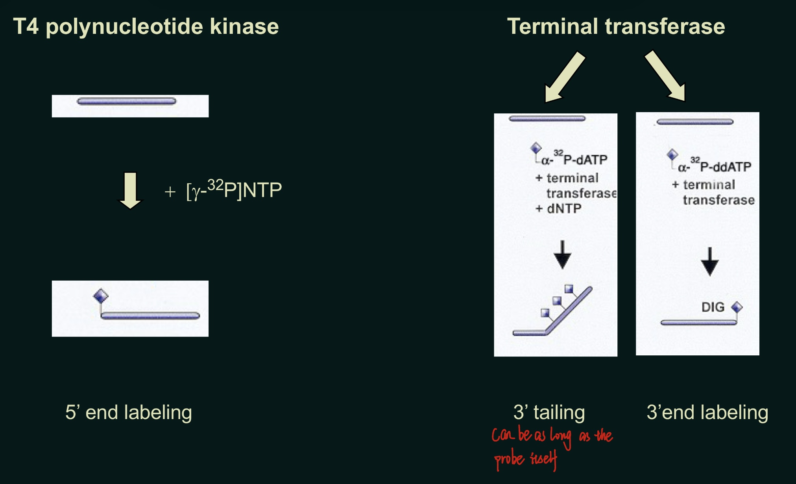

## Process

### Different blotting techniques

#### Comparison between blotting techniques

------

## 1. Synthesis of probes

Probes:
1. cDNA
   - Random primer labelling 
   - Nick translation 
1. cRNA
   - In-vitro transcription 
3. oligonucleotide
   - T4 polynucleotide kinase 
   - terminal deoxynucleotidyl transferase 

Label: 
1. radioactive 
   32P(stronger, higher resolution) or 33P 
   35S is not used because it is too weak and DNA breaks in the presence of sulfur
2. non-radioactive
   DIG, biotin, ECL …

### Choose conventional DNA probe / oligonucleotide probe

Conventional DNA probe: Can tolerate more mismatches. Be used to find homologous DNA sequences from 2 different organisms.
Oligonucleotide probe: Much shorter → Can tolerate less mismatches & easily washed way. Be used when high accuracy of binding is wanted.

### Random primer labelling (cDNA)

The ratio between template DNA and random primers is controlled to make the primers bind at ~ every 300 bps ← The nucleation point is 300 bps (the minimum length of which DNA strands tend to close like a zipper and form a double-stranded fragments. The pairing of fewer nuclotides are energetically not favourable and cannot form a fragment)

### Nick translation (cDNA)

### In-vitro transcription (cRNA)

Advantage: RNA-DNA hybridisation is more stable than DNA-DNA hybridisation.
No competing strand for probes generated: Only one template strands has the promoter and is transcribed. There is no complementary RNA sequences transcribed from the opposite strand.

### Comparison between the 3 methods

---

## 2. Labelling of probes

### Radioactive labelling of oligonucleotide probes

### Non-radioactive labelling

Same techniques as used for radioactive labelling can be applied when using non-radioactive labellinglike DIG, biotin, Cy2, Cy3, …

DIG: Coupled with alkaline phosphate via alkali-stable ether bond

----

## 3. Hybridisation

Probe anneals to complementary sequence at temperature below the melting temperature.

### Stringency

High stringency is required if we only wants identical sequences to hybridise (instead of highly similar sequences).
- Temperature ↑ -- Stringency ↑
- Low salt -- Stringency ↑
  Salt can help DNA strands to bind, even not identical sequences
- Denaturing agents (e.g. formamide) -- Stringency ↓

### Factors affecting kinetics of hybridisation

- Temperature 
  ~Tm-25˚C 
- Salt concentration = Ionic strength
  Rate increases with increasing salt 
- Base mismatches 
  Mismatches reduce rate 
- Base composition 
  Rate increases with increasing G+C 
- Fragments length 
  Probes shorter than target increase rate 
- Complexity of nucleic acid 
  Inversely proportional 
- Formamide/Urea 
  20% reduces rate (higher conc. no effect) 
- Dextran sulfate 
  Increases rate ← Excludes water
- Viscosity 
  Increased viscosity decreases rate of association

### Microarray technology

- Applications e.g. gene expression profiling, comparative genomic hybridization, SNP detection, alternative splicing ….. 
- Thousands of gene can be analyzed in parallel. 
- Gene chip arrays (Affymetrix) are fabricated using photolithographic technology to synthesis oligonucleotides directly on a glass surface. 
- Hybridization to Affymetrix chips is DNA:RNA. 
- Samples for hybridization are antisense copy RNA (cRNA) made in vitro using T7 RNA polymerase in the presence of biotinylated ribonucleotides bio-CTP and bio-UTP. 
- After hybridization of the biotinylated cRNA, the chip is stained with streptavidin phycoerythrin and read with a confocal scanner.
- Control and experimental samples are hybridized to separate chips. Comparison of the two chips is performed to determine the differential gene expression levels of the two compared samples

----

## Detection

**Radioactive probes** 
Autoradiography 
- X-ray film 
- Phosphoimager 

**Non-radioactive probes** 
- Colorimetric reaction 
- Chemiluminescent detection 
- Fluorescent detection

### Autoradiography

Smear bands: Probes bind to similar sequences.

### Non-radioactive probes

