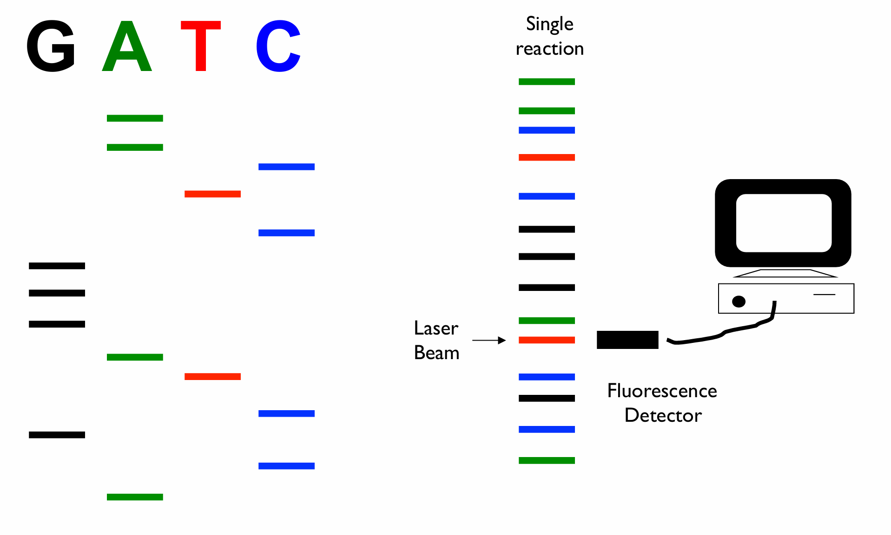

## "Plus and Minus" Sanger sequencing

### Process

The +/- method is a DNA synthesis methods performed in two steps. In step 1 DNA is synthetized using DNA polymerase and all 4 nucleotides, one of which is radioactively labelled. This aim of reaction is to produce a random mixture of complementary DNA of various length. In step 2 these synthesis products are divided into the "plus" group and the "minus" group. Each group is then further divided into 4 reactions one for each nucleotide.

**The plus reaction**
Each "plus" group reaction will be complemented with only one nucleotide (dATP, dCTP, dGTP or dTTP) and T4 polymerase. As a consequence, the T4 polymerase with use its 3' to 5' exonuclease activity but will stop at the nucleotide that is present in the plus mix.

**The minus reaction**
Each "minus" group reaction will then be complemented with three nucleotides "leaving out one" and DNA polymerase I. Therefore, the minus reactions will continue to synthetize DNA until the base missing in the mixture is reached.

The reaction products of all 8 reactions are then separated on a poly-acrylamid gel and the DNA sequence can be read.

### Material

- "Plus" reaction -- T4 polymerase: Has an exonuclease activity. Digests every base except for a specific one in A/T/G/C until it reaches it.
- "Minus" reaction -- DNA polymerase I
- Primer

### Advantage

- Rapid sequencing

### Disadvantage

- Requires single-stranded DNA
- Requires 8 reactions (4 for plus and 4 for minus). Can done by 4 reactions but has lower accuracy (need to do guessing to data)

- -----

## “Maxam and Gilbert” method (chemical sequencing)

### Process

1. DNA is radioactively labeled at its 5’ end.
2. The labeled DNA is divided into 4 separate tubes, each treated with a different set of chemicals that modify and cleave DNA at specific bases: G, A+G, C, C+T.
3. The resulting fragments are separated by gel electrophoresis.
4. The gel is exposed to an X-ray film. Reading the gel from bottom to top gives the 5’~3’ sequence of the labeled strand.

### Advantage

- Double-stranded DNA
- Only requries 4 reactions

### Disadvantage

- Requires strand separation

------

## Chain termination or dideoxy sequencing 

(Sanger sequencing – 1977)

### Process

1. A single-stranded DNA template is used. Normal dNTPs and a small proportion of ddNTPs(dideoxynucleotides) are added. Each ddNTPs is labeled with radioactive tag.
2. ddNTPs lacks the 3’-OH group. No further nucleotides can be added, so DNA synthesis terminates at that point.This generates a mixture of DNA fragments of different lengths, each ending at a specific base.
3. The reaction products are denatured by adding formamide and heating to separates the newly synthesized radioactive strands from the template.
4. The radioactive strands are loaded on to a thin poly-acrylamide gel containing urea and separated by electrophoresis at high voltage (~2500 V).
   -The thin gels allow a high resolution of DNA molecules: one base different in length.
   -Plates can be heated to keep the DNA denatured.
5.  The gel is fixed and dried and exposed to X-ray film. The radioactive label reveals the terminal base of each fragment.The sequence is read from smallest (fastest-moving) to largest fragment, giving the 5′→3′ sequence of the new strand.
    -Sequencing reads are initially ~100 nt per 4 lanes. It increased to ~350 nt with improvements to the label (35S replaced 32P) and the gel (wedged, longer gels, shark tooth comb) system

### Automation

- Number of lanes increased to up to 96 -- Sequencing 96 different DNA templates at the same time.
- Read length increased to up to 1000 nt per capillary per run.
- Replacing the gel electrophoresis by capillary electrophoresis.
  Separate the DNA fragments by size based on their total charge (5-20kV)
  1. Polyacrylamide gels are replaced by columns filled with entangled polymers: Higher reprofucibility, less risk of error, can be stored, can be done automatically with robots.
  2. Automatic sample loading: Electrokinetic injection

### Advantage

- Increased accuracy
- Only requires 4 reactions
  The products of 4 separate reactions are run on a polyacrylamide gel in 4 lanes

### Disadvantage

- Requires single stranded DNA

### Tips

- By adjusting the ratio of dNTP to ddNTP it is possible to generate the full spectrum of terminated products with approximately equal representation (Too much ddNTP gives preferentially short products. Too little ddNTP gives preferentially long product)

-----

## Dye-termination sequencing

### Process

1.  A single-stranded DNA template is used. Normal dNTPs and a small proportion of ddNTPs are added. Each ddNTPs is labeled with a different coloured fluorescent tag.
2. Sequencing reactions are performed in a PCR machine in a technique called cycle sequencing.
3. The DNA sequencing (detection of ddNTP terminal band) is done automatically by fluorescence detector.

### Advantage

- The DNA sequencing is automated
- Only requires 1 reaction (in 1 tube)

## Disadvantage

- Requires single stranded DNA
- The DNA products cannot be separated anymore, because DNA with different dyes swim differently due to different chemical structures of dyes
