# 1. Hill-Langmuir Equation

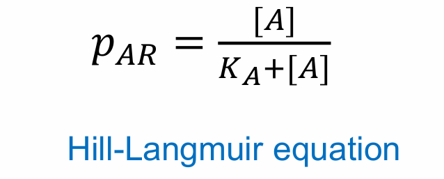

## Key assumptions

1) agonist is at equilibrium with the receptor ([ATOT] = [A] + [AR]); 
2) the free agonist concentration is essentially the same as the total agonist concentration ([A] ≈ [ATOT]).

## Efficacy

 = the ability of an agonist to elicit a functional response (maximal response)
- Defined by ymax / Emax
- = kopen/kclose (in del Castillo-Katz mechanism)
	- Full agonist → high E (efficient activation)
	- Partial agonist → low E (poor activation)

## Potency

- Defined by **EC₅₀**:
    - Concentration producing **50% maximal response**
    - ↓ EC₅₀ → ↑ potency, ↑ EC₅₀ → ↓ potency

## Affinity

- Defined by KA = dissociation constant
- KA = K-1/K+1
- A measure of the binding affinity of the agonist - low KA → high affinity
- - When [A]=KA, occupancy = 50%

### Sigmoid Curve in Log Scale

### Hill Plot

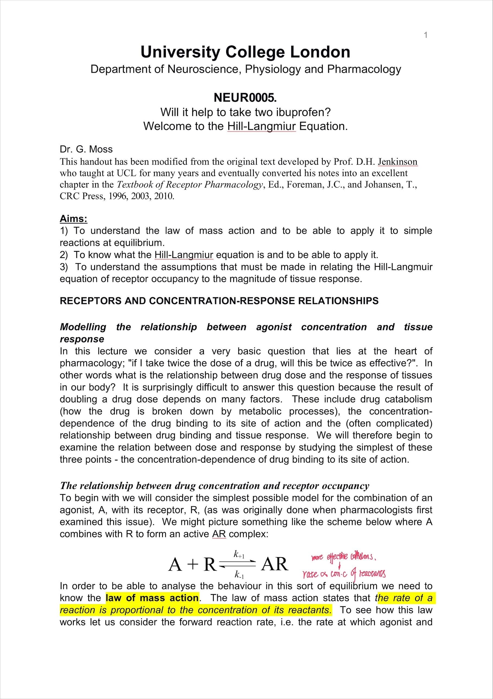

# 2. Hill equation

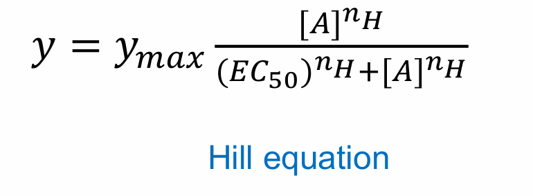

- Hill equation is empirical – used to describe, but not explain the data 
- Introduces a slope factor nH – the Hill coefficient 
- Useful for fitting a wide range of different kinds of data 
- Note that the EC50 is the not the same as KA

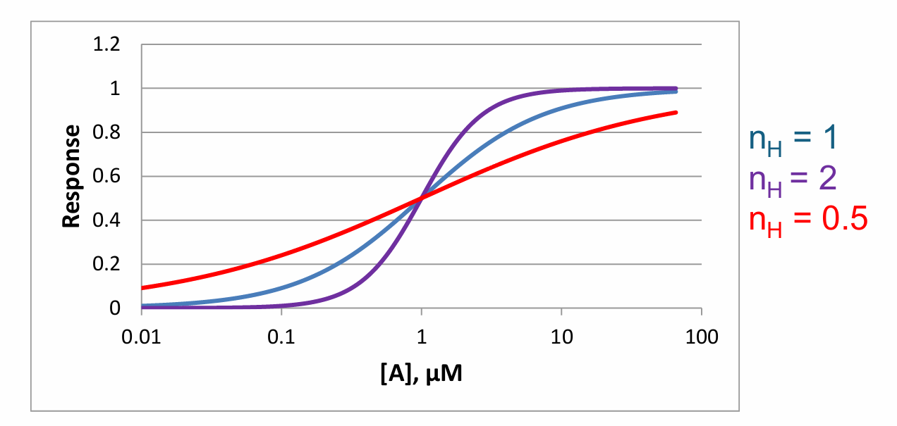

# 3. Full agonists and partial agoninsts

## 3.1 Definition

- **Full agonist** → produces maximal response
	1. **Isoprenaline** → β-adrenoceptor 
	2. Isoguvacine, THIP → GABAARs
- **Partial agonist** → cannot reach maximal response even at high dose
	1. **Prenalterol** → β-adrenoceptor
	2. P4S, 4-PIOL → GABAARs

## 3.2 Partial agonist

- Reduced efficacy ← Differential ability to activate receptors ← Differential changes in receptor conformation upon agonist binding
- Efficacy of partial agonists depends on
	1. how many spare receptors 
	2. tissue-specific (how many spare receptors in the tissue + other tissue-dependent factors e.g. uptake, diffusion, breakdown)

## 3.3 del Castillo-Katz mechanism

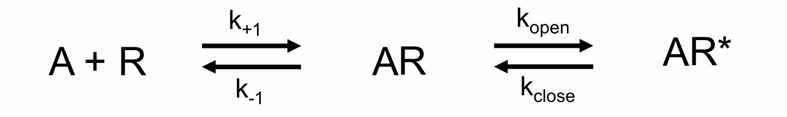

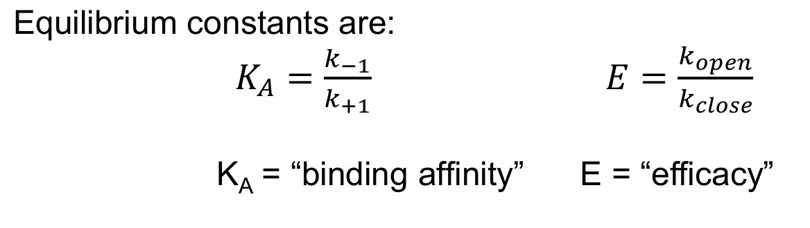

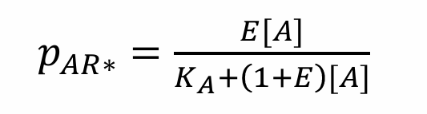

- Full agonist → high E (efficient activation)
- Partial agonist → low E (poor activation)

--------

# 4. Antagonism

## 4.1 Mechanisms of antagonists

1. **Chemical antagonism**
   = The “antagonist” binds to and prevents the effect of another agent.
	1) chelating agents 
	   e.g. dimercaprol – binds toxic heavy metal ions
	2) neutralising antibodies 
	   e.g. etanercept – binds tumour necrosis factor (TNF) 
2. **Pharmacokinetic antagonism**
   = The “antagonist” reduces the concentration of the active drug by affecting its pharmacokinetic profile. 
   e.g. phenobarbital (anti-convulsant) increases the hepatic metabolism of warfarin (anticoagulant) 
3. **Physiological antagonism** 
   = The “antagonist” is actually an agonist at a different receptor that produces the opposite functional response. 
   e.g. adrenaline acts as a functional antagonist of histamine at bronchial smooth muscle – causes relaxation to counterbalance the bronchoconstriction caused by histamine 
4. **Receptor antagonism**
   = The antagonist works at a receptor to reduce the action of an agonist

| Type            | Mechanism                              | Example                               |
| --------------- | -------------------------------------- | ------------------------------------- |
| Chemial         | Direct binding/inactivation            | **Dimercaprol** chelates heavy metals |
| Pharmacokinetic | Alters drug concentration              | Phenobarbital ↓ warfarin levels       |
| Physiological   | Opposing effect via different receptor | Adrenaline vs histamine               |
| Receptor        | Acts at same receptor                  | Atropine vs ACh                       |

### Mechanism of Receptor Mechanism

1. **Competitive antagonism**
   = Agonist and antagonist:
	- Bind to **same site**
	- Binding is **mutually exclusive**
2. **Non-competitive Antagonism**
   = Antagonist binds:
	- **Different site** (allosteric)
	- Independent of agonist binding

#### Example of competitive and non-competitive antagonists

| Target                        | Competitive | Non-competitive                   |
| ----------------------------- | ----------- | --------------------------------- |
| mAChRs                        | Atropine    | /                                 |
| NMDARs                        | /           | Ketamine (block ion channel)   |
| GABAARs | Bicuculline | Picrotoxin (block ion channel) |

----

## 4.2 Reversible Competitive Antagonists

- Agonist and antagonist binding are mutually exclusive, (usually because they bind to the same site)

### Gaddum Equation

### Effect on dose-response curve

- Parallel **rightward shift**
- **No change in Emax**
- Curve shape unchanged

#### Interpretation

- ↓ potency (↑ EC₅₀)
- Efficacy unchanged

### Schild Equation

- r = concentration ratio (shift in EC₅₀)
- KB = antagonist affinity

#### Derived form

log(r−1) = log[B] − logKB​

#### Key assumption

- Equal responses are caused by equal agonist occupancy of the receptor

### Schild plot

#### Interpretation

- Plot: log(r−1) on y-axis vs log[B] on x-axis
- **Slope = 1 → competitive antagonist**
- x-intercept  = KB

----

## 4.3 Non-competitive Antagonists

### Mechanism

Reduces:
- Number of functional receptors (AR* ↓)
- Or ability to activate receptor  (BAR ↑)

### Effect on dose-response curve

- Non-competitive antagonism reduces efficacy, not just potency

#### 1. Without spare receptors

- ↓ **Emax**
- No full recovery even with high agonist  
    → **insurmountable antagonism**

#### 2. With spare receptors

- Low antagonist:
    - Rightward shift (looks competitive)
- High antagonist:
    - ↓ Emax

#### - The Gaddum equarion

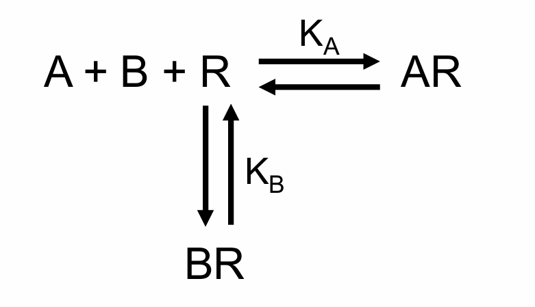

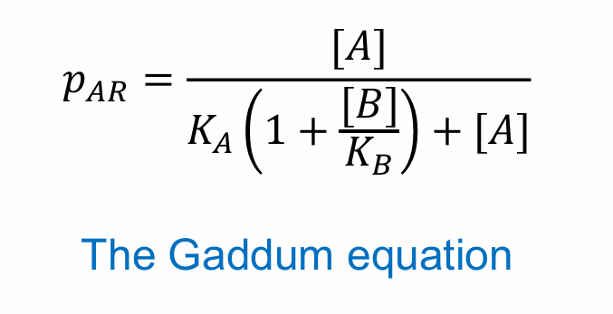

#### - The Schild equation

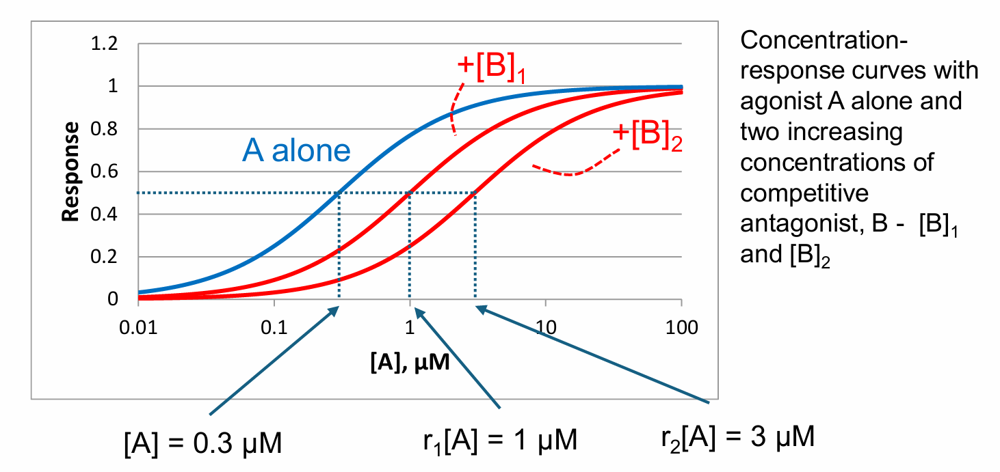

Shift is expressed as a concentration ratio, r. In this example, r1 = 3.33 and r2 = 10. 
Often expressesed as pA2 = -log[B]r=2 .

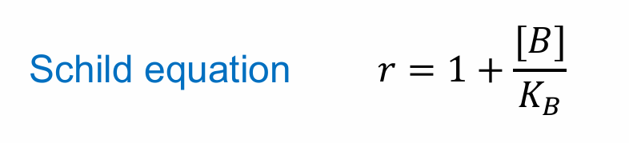

Rearrange Schild equation and take logs: 

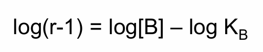

- This is a straight line with gradient 1 and x intercept = log KB

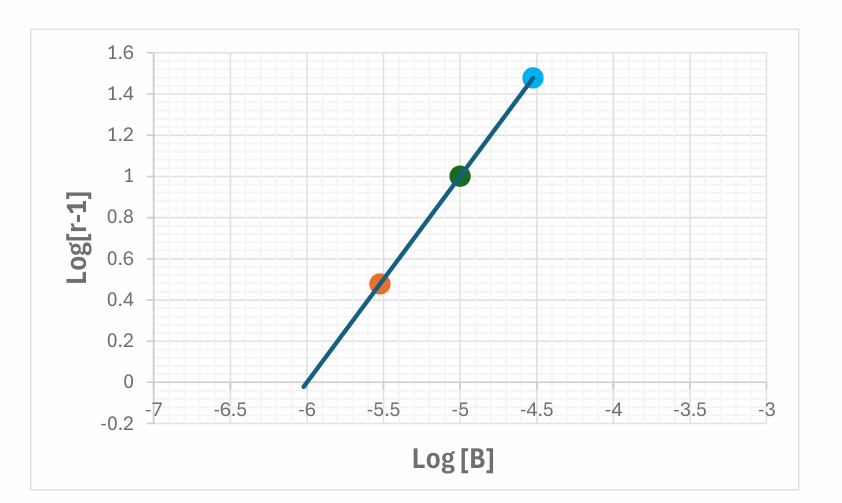

### Non-competitive antagonists

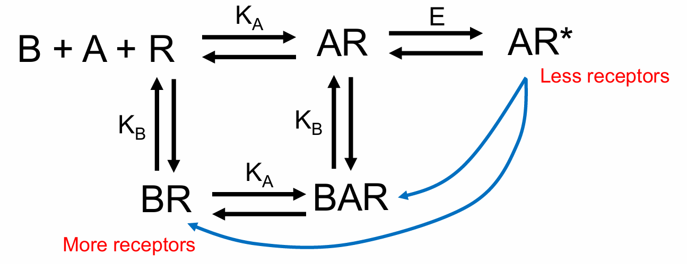

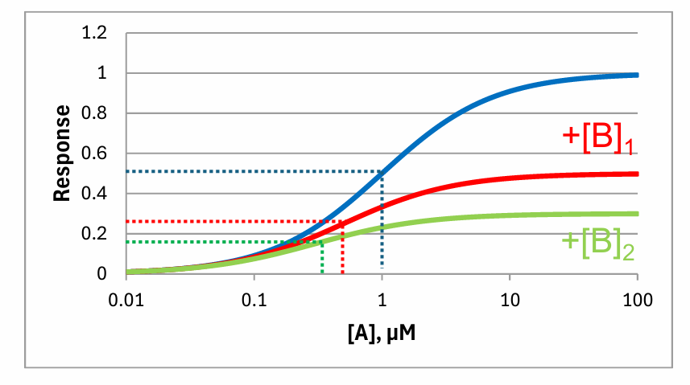

Predicts a depression in the maximal response and a leftward shift in the agonist concentration-response curve

-------

## Modern pharmacological equations

Modern drug binding assays often have high [R] e.g. multiwell plates with small volumes and high cell densities. If [R] is high then a high concentration of agonist will be bound – “Ligand depletion”, can’t make the assumption that [A] ≈ [ATOT] in Hill-Langmuir equation. Need to use different equations that don’t use [A]. 
High affinity ligands can take a long time to reach equilibrium with receptors. Equilibrium will not be reached during the time course of the assay

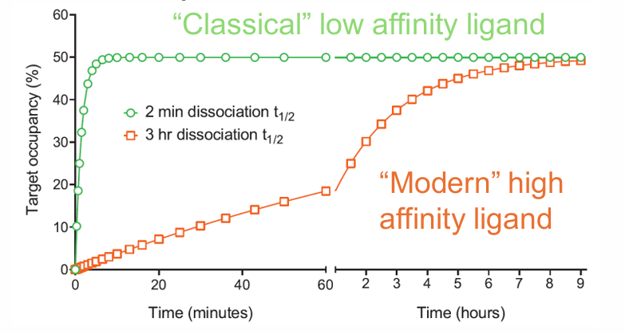

-----

# Example Question

## 1. “Explain the Hill-Langmuir equation and discuss its importance in understanding drug potency, efficacy, and affinity.”

The Hill-Langmuir equation describes the relationship between agonist concentration and receptor occupancy under simple equilibrium conditions:

​
where [A] is agonist concentration and KA is the dissociation constant, representing receptor affinity. When agonist concentration equals KA, 50% of receptors are occupied.

This model forms the basis for understanding concentration-response relationships in pharmacology. Affinity refers to how strongly a drug binds receptors and is inversely related to KA. Potency refers to the concentration required to produce a given response, commonly measured as EC₅₀. Lower EC₅₀ indicates greater potency. Efficacy describes the maximal response a drug can produce (Emax).

Importantly, potency, efficacy, and affinity are distinct concepts. A highly potent drug may require low doses but may still have low efficacy. Partial agonists may possess high affinity but reduced efficacy due to incomplete receptor activation.

When concentration-response curves are plotted on logarithmic scales, they produce sigmoidal relationships that facilitate comparison between drugs. The Hill equation introduces the Hill coefficient to describe slope and cooperativity.

Clinically, these principles guide dose selection, therapeutic window optimisation, and drug development. For example, opioids such as morphine are full agonists with high efficacy, whereas buprenorphine is a partial agonist with lower maximal effect but improved safety.

Thus, Hill-Langmuir principles are fundamental to modern receptor pharmacology and therapeutic drug design.

## 2. “Compare full agonists, partial agonists, and antagonists in receptor pharmacology.”

Full agonists, partial agonists, and antagonists differ in their ability to bind and activate receptors.

Full agonists bind receptors and produce maximal activation, generating the full physiological response. Their efficacy is high, as seen with drugs such as isoprenaline at β-adrenoceptors.

Partial agonists also bind receptors but produce submaximal activation even when occupying all available receptors. Their reduced efficacy results from lower intrinsic receptor activation capacity. Clinically, partial agonists may provide therapeutic effects with lower toxicity and can competitively reduce the action of full agonists. Buprenorphine is an important opioid example.

Antagonists bind receptors but produce no activation. Competitive antagonists reversibly bind the same site as agonists, causing parallel rightward shifts in dose-response curves with increased EC₅₀ but unchanged Emax. Atropine at muscarinic receptors is a classic example.

Non-competitive antagonists reduce receptor function through irreversible or allosteric mechanisms, lowering maximal response (Emax) and producing insurmountable antagonism. Ketamine’s NMDA channel blockade is an example.

Therapeutically, full agonists maximise efficacy but often increase toxicity risk, partial agonists offer safer ceiling effects, and antagonists suppress excessive receptor activity.

Overall, understanding these distinctions is crucial for predicting therapeutic response, adverse effects, and rational drug design.

## 3. “Describe competitive and non-competitive antagonism and explain their therapeutic implications.”

Antagonists reduce agonist effects by interfering with receptor signalling and are classified primarily as competitive or non-competitive.

Competitive antagonists bind reversibly to the same receptor site as the agonist. Because binding is mutually exclusive, increasing agonist concentration can overcome inhibition. Pharmacologically, this produces a parallel rightward shift in the concentration-response curve, increasing EC₅₀ without changing maximal efficacy (Emax). The Schild equation is used to quantify antagonist affinity. Atropine antagonism of muscarinic acetylcholine receptors is a classic example.

Non-competitive antagonists act either irreversibly at the agonist binding site or allosterically at distinct sites. These drugs reduce receptor number or functional capacity, decreasing Emax. Their effects cannot be fully overcome by increasing agonist concentration. Examples include ketamine at NMDA receptors and picrotoxin at GABA_A receptors.

Competitive antagonists offer clinical flexibility because blockade is surmountable and dosing can be adjusted. Non-competitive antagonists may provide stronger suppression but carry higher risks due to prolonged or irreversible inhibition.

For example, β-blockers provide reversible cardiovascular receptor blockade, while irreversible receptor suppression may be useful in toxicological emergencies but requires caution.

Thus, antagonist type strongly influences both pharmacodynamics and clinical safety. Understanding these principles is essential for therapeutic drug selection.
