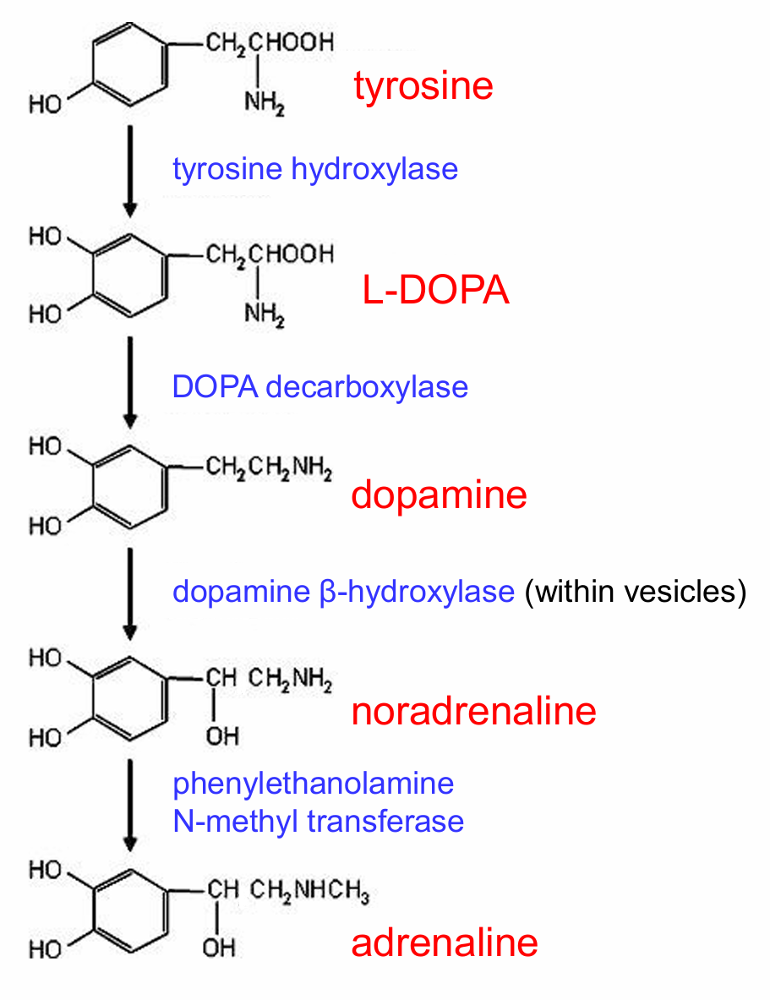
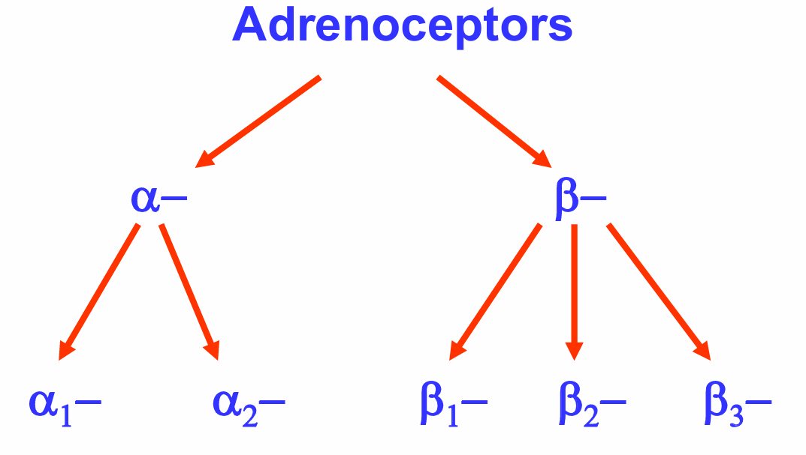
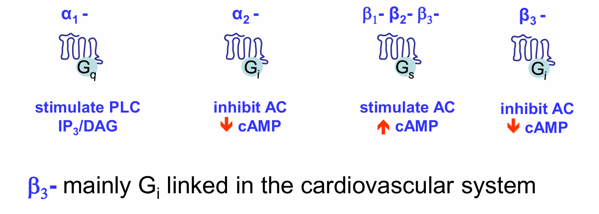
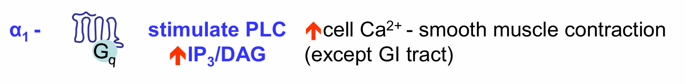
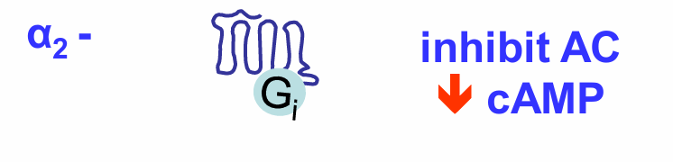
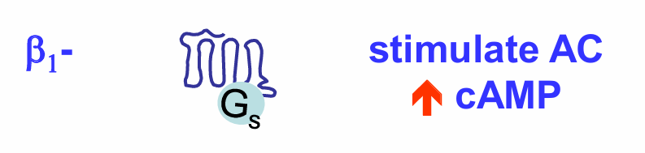
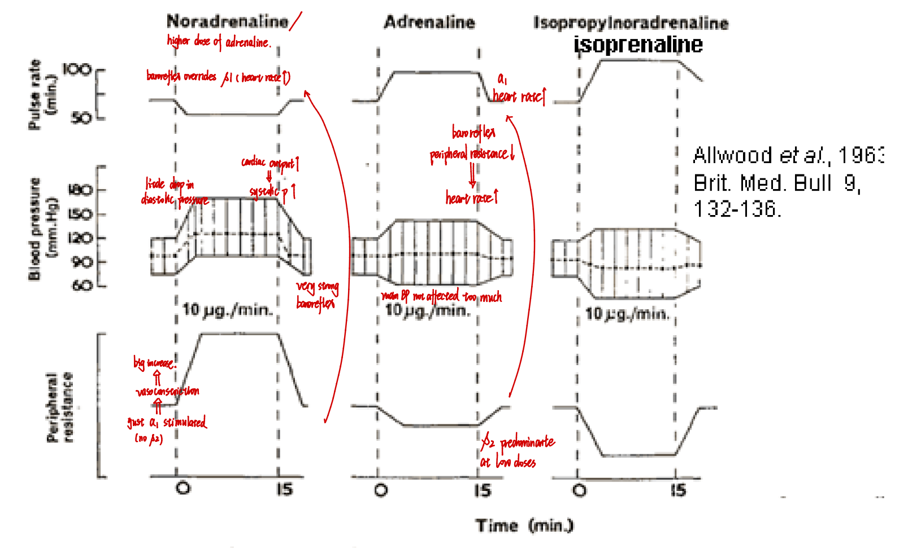

# 1. Synthesis of Catecholamines

# 2. Adrenoceptors

## **Endogenous agonists**

- adrenaline (A)
- noradrenaline (NA)

## Selectivity

- **A → α1, α2, β1, β2** 
- **NA → α1, α2, β1** 
- Isoprenaline → β1, β2, β3 

- β2 mostly non-innervated and stimulated by circulating adrenaline in bloodstream
- Others mostly innervated by sympathetic nerves

Note: cAMP has an excitatory effect (contraction) in heart and an inhibitory effect (relaxation) in smooth muscle.

-----

# 3. Classification of Adrenoceptors

## α1

- post-junctional 
- heteroreceptor

### Location & function

- **Almost all vascular smooth muscle (except  in skeletal muscle - β2)→ vasoconstriction**
- Mechanism:
    - Gq → ↑Ca²⁺ → contraction

### Physiological role

- Maintains **vascular tone & BP**

### Drug example

- Phenylephrine (α₁ agonist)
    - Use: nasal decongestant, hypotension

## α2

### Location & function

- **Pre-synaptic autoreceptor** (main role)
    - ↓ NA release (negative feedback)
- Also post-synaptic:
    - Smooth muscle contraction
    - ↓ insulin release
    - Platelet aggregation

### Drug examples

- Brimonidine → glaucoma
- In glaucoma:
    - ↓ aqueous humour production
    - ↑ outflow

## β1

### Location & function

- **Heart** → ↑ HR (chronotropic), ↑ force (inotropic)
	- Mechanism:
	  ↑ cAMP →  ↑ [Ca2+] → shorten depolarisation in SA node → shorten interval of HB → ↑ HR
- **Kidney (JGA)** → ↑ renin release → ↑ reabsorption of salt and water
- **Adipose tissue** → lipolysis

### Drug example

- Dobutamine (β₁ agonist)
    - Use: acute heart failure (inotrope)

## β2

### Location & function

- **Almost all non-vascular smooth muscle + Vascular smooth muscle in skeletal muscles**
- **ALWAYS smooth muscle dilation**
	- Bronchi → bronchodilation
    - Sleletal muscle vasculature → vasodilation → ↑ bloodflow
    - Uterus → relaxation

### Metabolic effects

- Pancrease
	- ↑ insulin release
	  (α2 - ↓ insulin release)
- Liver & Skeletal muscle
	- ↑ glycogenolysis
- Skeletal muscle
	- ↑ glycolysis, lactate release
- White adipocytes
	- ↑ lipolysis
	  (α2 - ↓ lipolysis)

## β3-adrenoceptors

### Location & function

- Vasulature → vasodilation (NO-mediated)
- Brown adipoytes → thermogenesis 
  → (mitochondria express a protein called UCP1. When UCP1 is stimulated by β3, fatty acids are broken down but not producing ATP→gnerating heat)
- Bladder → relaxation → urine storage

-----

# 4. Adrenaline Effect

## 4.1 Dose-dependent effects

- **Low dose → β effects dominate**
    - Vasodilation (β₂), ↓ BPR → ↓ BP
- **High dose → α effects dominate**
    - Vasoconstriction (α₁), ↑ BPR → ↑ BP

## 4.2 Clinical use of adrenaline

- **Anaphylactic shock**
    - α₁ → vasoconstriction → ↑ BP, ↓ oedema
    - β₂ → bronchodilation  
- Mast cell "stabilisation"
	- β₂ - Gs → ↑ AC → ↑ cAMP↑ → **inhibits degranulation** → ↓ inflammatory mediators (e.g. histamine) release
- Cardiac arrest
	- α₁ (heart)
- Tremor
	- β₂ (skeletal muscles)
- Prolongation of local anaesthetic action
	- α₁ → vasoconstriction → ↓ local bloodflow → ↓ drug washout into circulation → ↑ local [drug]

-----

# 5. Adrenoceptors in Modulating Blood K+ Levels

| Arenoceptor / drug                    | Location        | Effect                                         | Mechanism                                      |
| ------------------------------------- | --------------- | ---------------------------------------------- | ---------------------------------------------- |
| α1                                    | Liver           | Hyperkalaemia                                  | Release of K+                       |
| β2 (e.g. Salbutalmol at high dose) | Skeletal muscle | Hypokalaemia                                   | Stimulate Na+/ K+ ATPase |
| A                                     | non-selective   | Initial hyperkalaemia → Sustained hypokalaemia | /                                              |

-----

# 6. Direct vs Indirect Sympathomimetics

## 6.1 Direct-acting

- Bind receptors directly

| Exmaple                      | Agonist Target | Clinical Case                                      | Effect                                                                       |
| ---------------------------- | -------------- | -------------------------------------------------- | ---------------------------------------------------------------------------- |
| NA                           | α1, α2, β1     | Circulatory shock                                  | ↑ BP (no dose-dependent effect as A)                                      |
| Phenylephrine Methoxamine | α1             | Nasal decongestants (nose block) Hypotension | Nasal constriction                                                           |
| Brimonidine                  | α2             | Glaucoma                                           | (In ciliary body) ↓ Aqueous humour production ↑ Aqueous humour outflow |
| Dexmedetomidine Clonidine | α2             | Use in sedation/analgaesia Old antihypertensive | ↓ BP                                                                         |
| Dobutamine                   | β1             | Use as cardiac inotrope                            | ↑ BP                                                                         |
| Salbutamol Salmeterol     | β2             | Asthma (bronchal constriction) Premature labour | Smooth muscle dilation                                                       |
| Mirabegron                   | β3             | Overactive bladder                                 | Bladder relaxation                                                           |
- Unwanted effects (β2-agonists), occurs if high doses of drug:
	- hypokalaemia, tremor, peripheral vasodilation, reflex tachycardia

## 6.2 Indirect-acting

### Drug

- Tyramine
- Ephedrine
- Amphetamine

### Mechanism

1. Enter nerve terminal via uptake 1
2. Displace NA from vesicles (VMAT)
3. Reverse transport → NA release into cytosol
4. NA efflux by uptake 1 revserse transport
5. NA act on postsynaptic receptors
Note:
- Exocytosis is not involved → No Ca²⁺ or AP required

### Effect

- Strong amplification of sympathetic activity

### Clinical use

- Acute heart failure
- Cardiogenic shock

----

# 7. Integrative effects of NA/A/isoprenaline on heart

----

# 8. Pomotion of Adrenergic Function

## 8.1 Uptake inhibitors

- **Cocaine, TCAs (tricyclic antidepressants), reboxyteine** 
	- Block NET
	- → ↑ NA in synapse
- Mechanism of antidepressants

## 8.2 MAO inhibitors

- Block breakdown of monoamines (NA, DA, 5-HT, tyramine)

| MAO type | Monoamine              |
| -------- | ---------------------- |
| MAO-A    | NA, DA, 5-HT, tyramine |
| MAO-B    | DA, tyramine           |

- Example:

| Drug        | Effect                        | Side-effect                                                                     | Clinical use   |
| ----------- | ----------------------------- | ------------------------------------------------------------------------------- | -------------- |
| Phenelzine  | Irreversible Non-selective | Cheese reaction (Unable to metabolise tyramine in gut → Hypertension in gut) | /              |
| Moclobemide | Reversible MAO-A selective | /                                                                               | Antidepressant |

----

# Example Question

## Q1: “Compare the pharmacology, therapeutic uses, and adverse effects of α1-, β1-, and β2-adrenoceptor agonists.”

Adrenergic agonists act on distinct adrenoceptor subtypes to produce specific physiological effects. α1-adrenoceptors are Gq-coupled receptors located primarily on vascular smooth muscle, where activation stimulates PLC/IP3/Ca²⁺ signalling, causing vasoconstriction. Phenylephrine is a selective α1 agonist used clinically for nasal decongestion and hypotension due to its ability to increase vascular tone and blood pressure. However, excessive vasoconstriction may cause hypertension, reflex bradycardia, and reduced tissue perfusion.

β1-adrenoceptors are Gs-coupled receptors located mainly in the heart and kidney. Activation increases cAMP, leading to increased intracellular Ca²⁺, enhanced heart rate, contractility, and renin release. Dobutamine, a β1 agonist, is used in acute heart failure and cardiogenic shock because it improves cardiac output. Its limitations include tachycardia, arrhythmias, and increased myocardial oxygen demand, which may worsen ischemia.

β2-adrenoceptors are also Gs-coupled but are mainly found on non-vascular smooth muscle such as bronchi and uterus. Increased cAMP causes smooth muscle relaxation. Salbutamol and salmeterol are β2 agonists widely used in asthma and premature labour for bronchodilation and uterine relaxation. Major adverse effects include tremor, peripheral vasodilation, reflex tachycardia, and hypokalaemia due to stimulation of Na⁺/K⁺-ATPase in skeletal muscle.

Therapeutically, receptor selectivity is crucial to maximise benefit while limiting side effects. α1 agonists are most useful for vascular support, β1 agonists for cardiac stimulation, and β2 agonists for smooth muscle relaxation. Despite their effectiveness, all adrenergic agonists carry risks of cardiovascular overstimulation, limiting their long-term use.

## Q2: “Explain the dose-dependent effects and major therapeutic applications of adrenaline.”

Adrenaline is an endogenous catecholamine that acts on α1, α2, β1, and β2 adrenoceptors. Its pharmacological effects are dose-dependent because different receptor subtypes have different sensitivities. At low doses, β-effects predominate, particularly β2-mediated vasodilation in skeletal muscle vasculature, causing reduced peripheral resistance and lowered blood pressure. β1 stimulation simultaneously increases heart rate and cardiac contractility.

At higher doses, α1-mediated vasoconstriction becomes dominant, increasing total peripheral resistance and blood pressure. This shift explains adrenaline’s biphasic cardiovascular response and is highly relevant clinically.

Adrenaline’s most important therapeutic use is in anaphylactic shock, where it simultaneously addresses multiple life-threatening mechanisms. α1 activation reverses hypotension and reduces oedema via vasoconstriction, β2 activation causes bronchodilation, and β2-mediated mast cell stabilisation reduces further histamine release by increasing cAMP and inhibiting degranulation.

Adrenaline is also used during cardiac arrest to improve coronary and cerebral perfusion pressure via α1 vasoconstriction. Additionally, it is commonly combined with local anaesthetics to prolong their action by reducing local blood flow and slowing systemic drug absorption.

Despite these benefits, adrenaline has important limitations. β1 stimulation can cause tachycardia and arrhythmias, while β2 activation may produce tremor and hypokalaemia. High doses can lead to excessive hypertension and tissue ischemia.

Overall, adrenaline is a highly versatile sympathomimetic with life-saving uses, particularly in emergency medicine, but careful dose control is essential due to its broad receptor activation and significant adverse effect profile.

## Q3: “Distinguish between direct-acting and indirect-acting sympathomimetics, including mechanisms, uses, and limitations.”

Sympathomimetics enhance adrenergic function either by directly activating adrenoceptors or indirectly increasing endogenous noradrenaline (NA) availability.

Direct-acting sympathomimetics bind directly to adrenoceptors. Examples include phenylephrine (α1 agonist), dobutamine (β1 agonist), and salbutamol (β2 agonist). These drugs offer receptor selectivity, allowing targeted therapeutic applications such as hypotension, acute heart failure, and asthma. Their effects are generally predictable, but side effects depend on receptor overstimulation, including hypertension, tachycardia, tremor, and arrhythmias.

Indirect-acting sympathomimetics, such as amphetamine, tyramine, and ephedrine, increase adrenergic signalling by entering presynaptic nerve terminals via uptake transporters, displacing NA from vesicles through VMAT, and promoting reverse NA transport through NET. This causes large increases in synaptic NA without requiring action potentials or Ca²⁺-dependent exocytosis.

Indirect agents produce amplified sympathetic activation and historically had uses in shock and heart failure, though many are now limited due to toxicity. Their major disadvantages include tachyphylaxis from transmitter depletion, hypertensive crises, CNS stimulation, and abuse potential, particularly with amphetamines.

A key pharmacological distinction is that direct agonists remain effective even when nerve terminals are depleted, whereas indirect agents depend on sufficient endogenous NA stores. This is clinically relevant in conditions such as tyramine interactions with MAO inhibitors, where excessive NA release may trigger severe hypertension (“cheese reaction”).

Overall, direct sympathomimetics provide more selective and controllable therapeutic effects, whereas indirect sympathomimetics produce broader sympathetic activation with greater risks and fewer modern clinical applications. Understanding this distinction is essential for predicting both therapeutic efficacy and toxicity.
